# PDF4QT AI Agent 实施计划

## 目标

本文档描述了为 `PDF4QT` 添加内部 AI Agent（智能体）功能的务实实施计划。

该计划基于当前的代码库结构，而不是最初的抽象 UML。实施应满足以下要求：

* 复用现有的 Qt 插件和 UI 架构
* 复用 `PDFProgramController`、`PDFWidget` 以及文档生命周期
* 优先使用 Qt 原生的网络和 JSON 处理机制
* 分阶段交付功能，确保每个阶段都可以独立测试

## 项目现状检查

当前代码库已经提供了：

* `Pdf4QtEditor` 作为应用程序的入口目标
* `Pdf4QtLibGui` 作为主 GUI 和控制器层
* `Pdf4QtEditorPlugins` 作为扩展机制
* `PDFProgramController` 作为活动文档状态的拥有者
* `PDFPlugin` 作为工具扩展的集成点
* `QDockWidget` 作为侧边栏的成熟 UI 模式

这意味着 AI Agent 功能不应直接在轻量级的 `Pdf4QtEditor` 启动目标中实现。推荐的路径是：

1. 在 `Pdf4QtLibCore` 下构建核心 Agent 后端逻辑
2. 在 `Pdf4QtLibGui` 或插件层做 GUI 适配与交互桥接
3. 通过新的 `Pdf4QtEditorPlugins/AgentPlugin` 暴露聊天功能
4. 将 Qt 网络和 Qt JSON 组件作为首选的实现方式

## 推荐架构

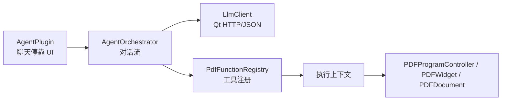

## 目录结构

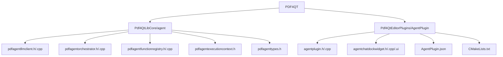

## 技术选型

### 优先使用 Qt 组件

首个实现版本应使用：

* `QNetworkAccessManager`
* `QNetworkRequest`
* `QNetworkReply`
* `QJsonObject`
* `QJsonArray`
* `QJsonDocument`
* `QSettings`
* `QDockWidget`

### 阶段 1 应避免的技术

首个实现版本应避免：

* 引入新的协程框架 (Coroutine framework)
* 引入新的文档所有权模型
* 在单一提供商（Provider）稳定之前，进行多提供商的抽象
* 直接暴露所有内部的 PDF 操作

## 高层组件设计

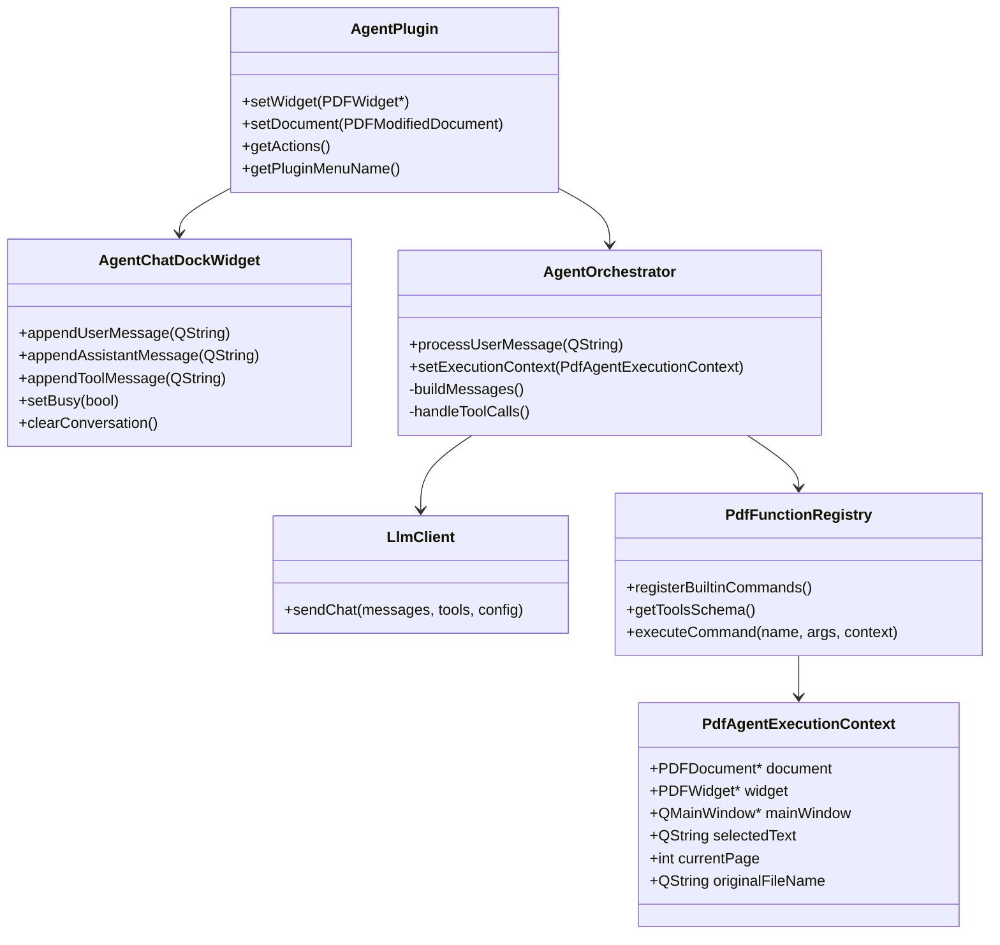

## 阶段计划

---

### 阶段 1：基础网络通信

**目标**
构建用于聊天补全（Chat Completion）的最小网络路径。暂不包含工具调用（Tool Calling）。

**结果**
系统能够将提示词（Prompt）发送到已配置的模型端点，并返回助手的文本回复。

**范围**

* 添加 `LlmClient`
* 添加配置结构（端点、模型、API 密钥、系统提示词）
* 添加请求和响应的解析逻辑
* 添加错误报告
* 首先支持一种提供商契约，最好是兼容 OpenAI 的聊天格式

**请求流**

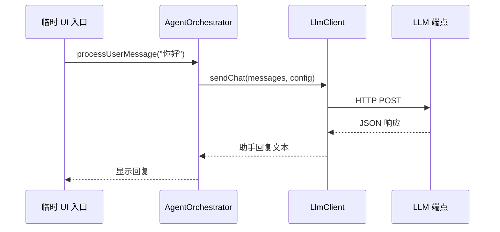

**建议的文件**

* `Pdf4QtLibGui/agent/pdfagentllmclient.h`
* `Pdf4QtLibGui/agent/pdfagentllmclient.cpp`
* `Pdf4QtLibGui/agent/pdfagenttypes.h`

**建议的类型**

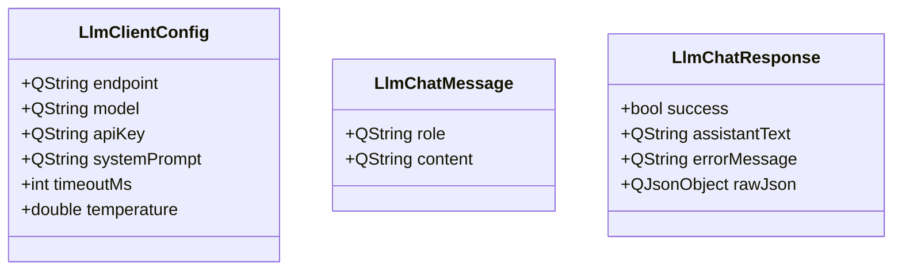

**验收标准**

* 能够发送一条文本消息并接收一条文本回复
* 能够在 UI 中显示网络和解析错误
* 无需重启应用程序即可应用配置更改

**风险**

* 不同提供商的响应数据结构可能有所不同
* API 认证头规则可能有所不同
* 不同环境下的超时和 SSL 行为可能存在差异

---

### 阶段 2：聊天 UI

**目标**
在编辑器内部创建一个基础的聊天界面。

**结果**
用户可以与类似于 ChatGPT 对话视图的停靠面板进行交互。

**范围**

* 添加 `AgentPlugin`
* 添加 `AgentChatDockWidget`
* 添加消息列表、输入框、发送按钮、清除按钮、状态标签
* 将 UI 绑定到阶段 1 的聊天路径

**UI 布局**

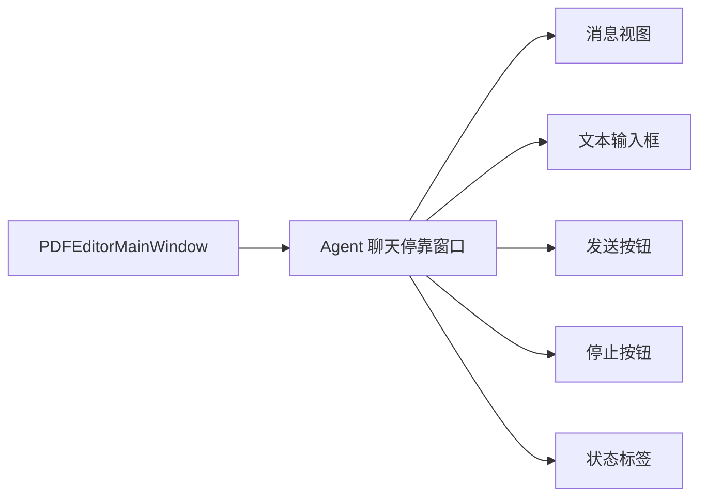

**会话模型**

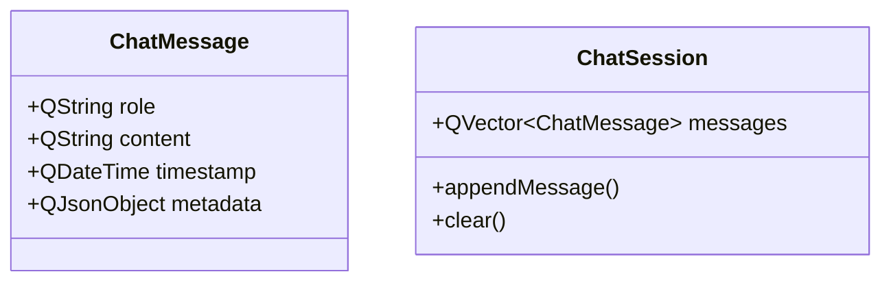

**集成说明**
插件应依赖现有的插件生命周期回调：

* `setWidget(PDFWidget*)`
* `setDocument(const PDFModifiedDocument&)`
* `m_dataExchangeInterface->getSelectedText()`
* `m_dataExchangeInterface->getMainWindow()`

**验收标准**

* 插件成功加载
* 停靠窗口可见且可用
* 消息按顺序追加显示
* 清除对话功能正常工作
* UI 中能够正确显示错误信息

---

### 阶段 3：模拟工具路由

**目标**
构建命令注册表（Command Registry），并将模拟的工具调用路由到内部的 PDF 函数。

**结果**
无需依赖真实模型的工具调用能力，系统就已经能够通过结构化的模拟响应来触发内部函数。

**模拟工具流**

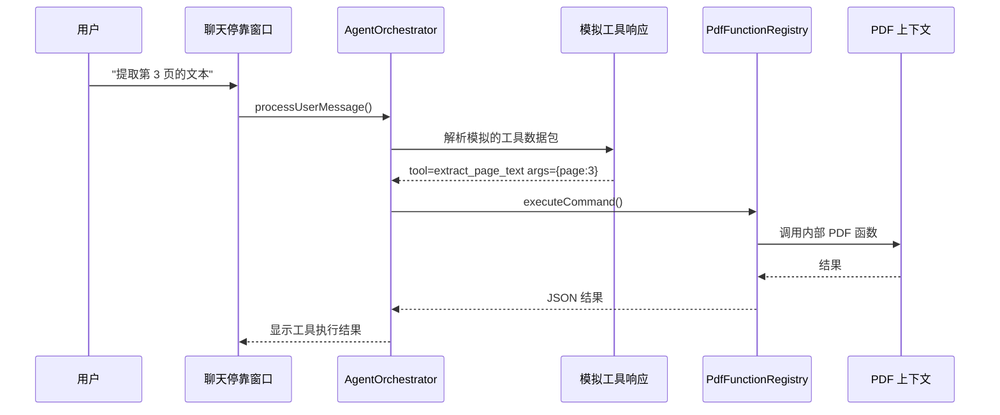

**首批命令集**
首批注册的命令应当是只读的：

* `get_document_summary` (获取文档摘要)
* `get_current_page` (获取当前页码)
* `extract_selected_text` (提取选中文本)
* `extract_page_text` (提取页面文本)
* `list_bookmarks` (列出书签)

**命令模型**

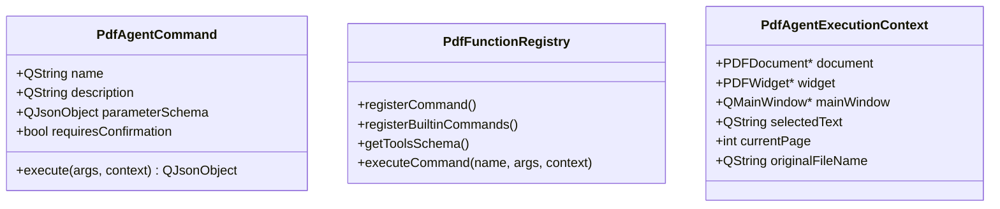

**模拟输出格式**
建议格式：

```json
{
  "tool_calls": [
    {
      "name": "extract_page_text",
      "arguments": {
        "page": 3
      }
    }
  ]
}

```

**验收标准**

* 模拟输出能够触发内部命令的执行
* 错误的命令名称能够安全地失败处理
* 文档缺失时能够安全地失败处理
* 工具的执行结果可以显示在聊天流中

---

### 阶段 4：真实的工具调用

**目标**
将真实模型的工具调用（Tool-Calling）连接到内部命令注册表。

**结果**
模型可以选择一个工具，应用程序执行该工具，并将结果返回给模型以生成最终响应。

**工具调用流**

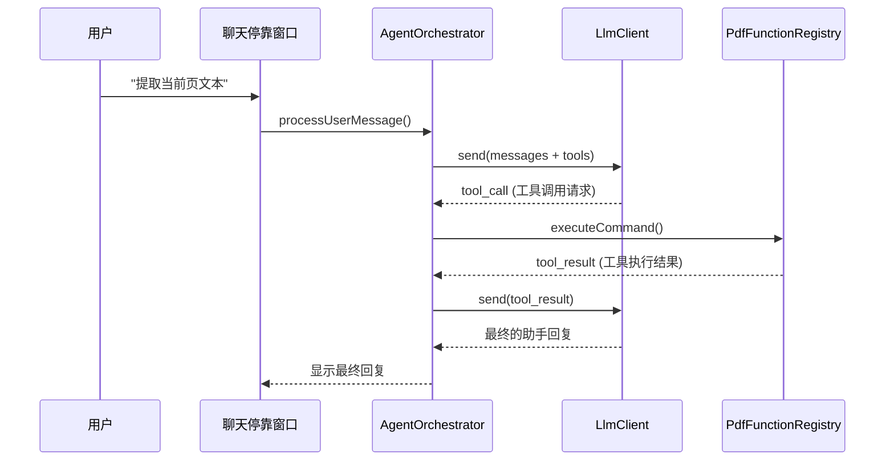

**编排规则**

* 限制工具调用的轮次（例如最多 3 轮）
* 检测格式错误的工具数据包
* 在连续失败时停止执行
* 在聊天历史中同时持久化助手消息和工具消息

**验收标准**

* 真实的工具调用可以端到端执行
* 工具执行后显示最终的自然语言回复
* 防止无限循环
* 将工具错误信息反馈给用户

---

### 阶段 5：修改性命令

**目标**
支持会改变 PDF 状态的命令，并要求用户显式确认。

**结果**
AI Agent 可以请求执行修改文档的操作，但只有在用户确认后才会实际执行。

**安全控制流**

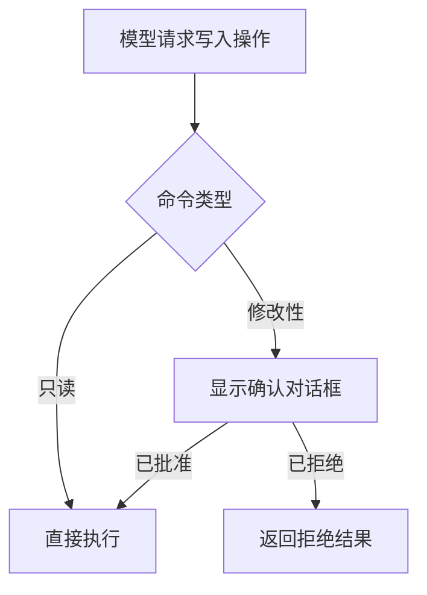

**首批修改性命令**
仅在只读流程稳定后引入：

* `add_watermark` (添加水印)
* `save_document_as` (另存为文档)
* `create_bookmark` (创建书签)
* `remove_external_links` (移除外部链接)

**必要的安全措施**

* 每个命令必须暴露 `requiresConfirmation` 标志
* 确认对话框必须显示预期的操作和目标文件
* 如果被拒绝，拒绝结果必须通过编排器（Orchestrator）返回给模型

**验收标准**

* 没有任何修改性命令会被静默执行
* 干净地处理用户的拒绝操作
* 成功执行后，文档状态能够正确刷新

---

### 阶段 6：设置与诊断

**目标**
通过设置、诊断工具和可维护性改进来稳定该功能。

**结果**
AI Agent 变得可配置、可调试，并适合持续迭代。

**范围**

* 通过 `QSettings` 添加持久化设置
* 添加提供商配置 UI
* 添加用于查看原始 JSON 和工具追踪的调试模式
* 添加模拟模式（Mock mode）开关
* 如有必要，添加使用情况日志钩子（Hooks）

**设置流**


**建议的设置项**

* `endpoint` (端点)
* `model` (模型)
* `api_key` (API 密钥)
* `system_prompt` (系统提示词)
* `temperature` (温度)
* `timeout_ms` (超时时间)
* `enable_tools` (启用工具)
* `enable_mock_mode` (启用模拟模式)
* `debug_show_raw_json` (调试：显示原始 JSON)

**验收标准**

* 设置在会话之间持久化保存
* 可以启用和禁用调试数据
* 模拟模式可以在无网络连接的情况下使用

## 阶段依赖关系

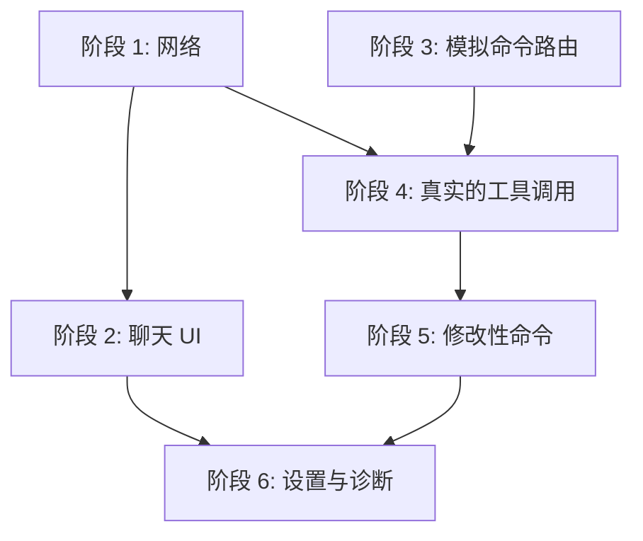

推荐的执行顺序：

1. 阶段 1
2. 阶段 2
3. 阶段 3
4. 阶段 4
5. 阶段 5
6. 阶段 6

## 当前集成约束

### 文档所有权

AI Agent **不应**拥有活动 PDF 文档的所有权。

相反，它应该通过以下方式消费当前文档：

* `PDFPlugin::setDocument(...)`
* `PDFPlugin::setWidget(...)`
* 现有的 `PDFProgramController` 状态

这保持了与当前应用程序模型一致的所有权机制。

### 异步模型

首个实现应使用 Qt 的事件驱动异步模型，而不是引入新的协程框架。

原因：

* 它与现有的代码库风格保持一致
* 降低了实施风险
* 将功能交付与架构试验解耦

如果后期仍然希望支持协程，应在网络和工具编排路径已经稳定之后再引入。

## 测试策略

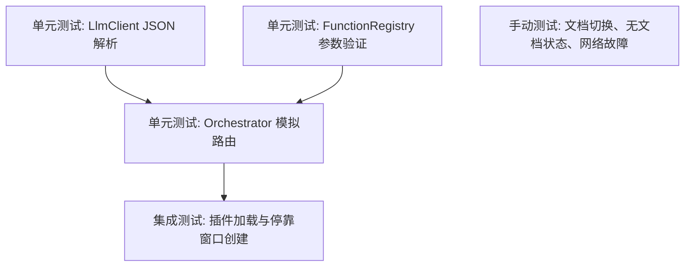

### 最低测试建议

* LLM 响应解析的成功和失败用例
* 注册表对未知命令的处理
* 缺失参数和类型错误的验证
* 模拟工具调用的编排测试
* 有/无活动文档状态下的插件加载测试

## 初始 CMake 影响

预期的构建变更：

* 向 `Pdf4QtLibCore` 添加 `Qt6::Network` 依赖
* 在 `Pdf4QtLibCore/agent` 目录下添加新的源文件
* 在 `Pdf4QtEditorPlugins/AgentPlugin` 目录下添加新的插件目标 (Plugin Target)
* 从 `Pdf4QtEditorPlugins/CMakeLists.txt` 中注册该插件

## 建议的首个实现冲刺

首个实际的实施冲刺（Sprint）应以以下内容为目标：

1. 向 `Pdf4QtLibCore` 添加 `Qt6::Network`
2. 添加 `LlmClient` 及其配置类型
3. 添加一个极简的 `AgentPlugin`
4. 添加一个带有基础输入和输出功能的停靠窗口
5. 验证一条请求和一条回复的完整路径

这将提供一个可见的端到端成果，而不会让项目过早陷入抽象设计的泥潭。

## 下一份文档

建议的下一份设计文档是：

* `PHASE_1_AI_AGENT_TECHNICAL_DESIGN.md` (阶段 1 AI Agent 技术设计文档)

该文档应定义：

* 精确的类接口
* 信号（Signal）和槽（Slot）的职责
* 请求和响应的 JSON 契约
* 设置项的键名（Keys）
* 最少的 UI 交互细节
* 实施检查清单
