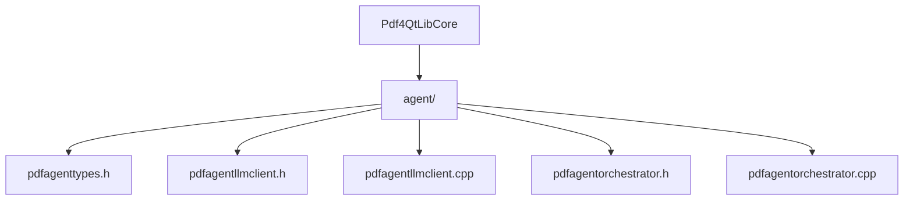
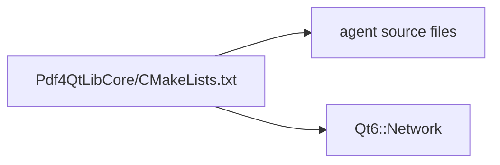
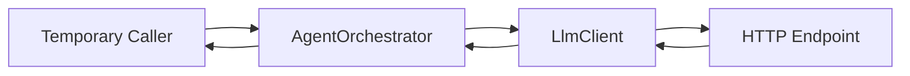
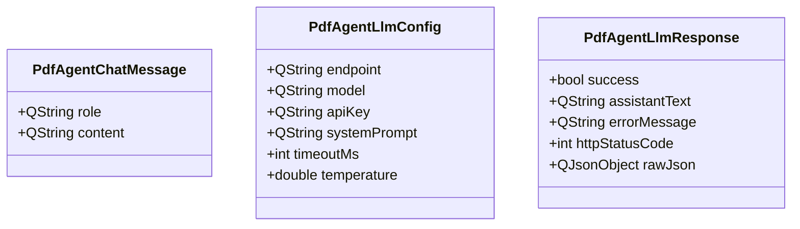
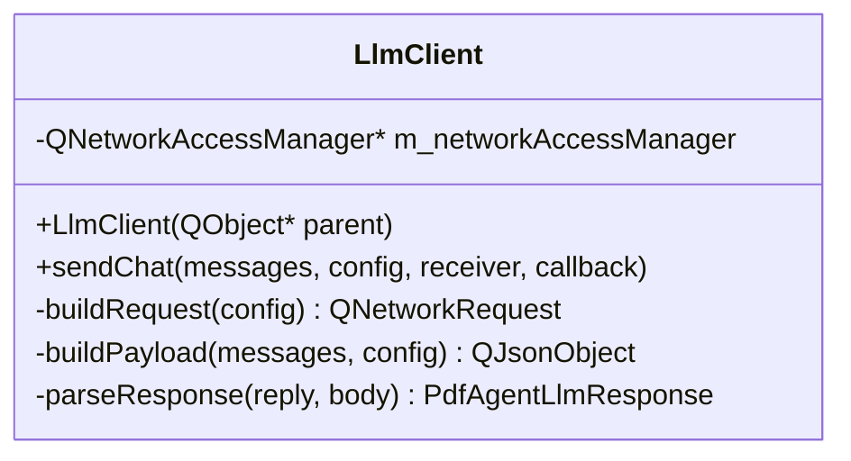
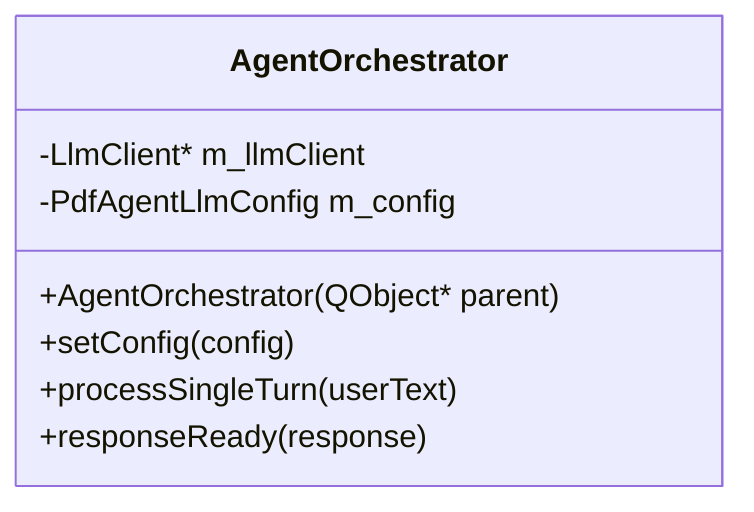
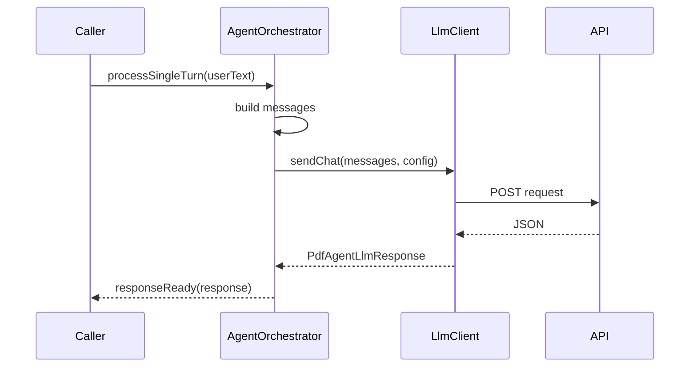
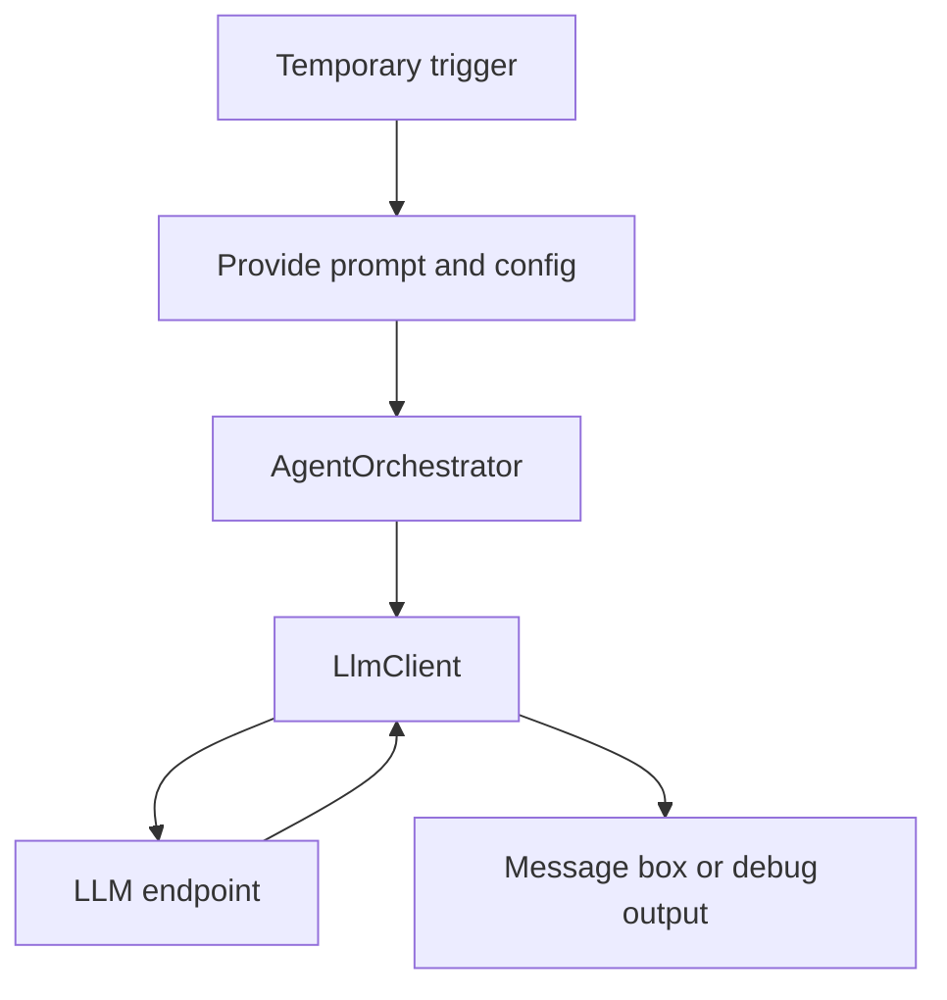
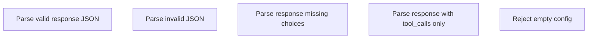
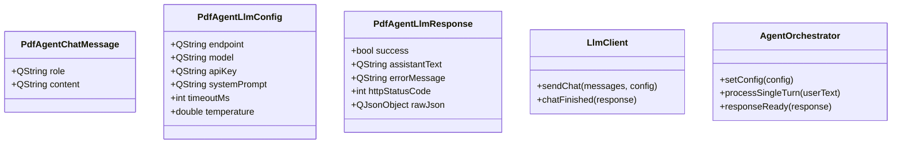

# PDF4QT AI Agent Phase 1 Technical Design

## Purpose

This document defines the implementation details for Phase 1 of the AI Agent feature in `PDF4QT`.

Phase 1 is intentionally narrow:

- build the minimum network layer
- support one provider contract first
- return plain assistant text
- avoid tool-calling for now
- avoid plugin UI complexity beyond what is needed for validation

The goal is to establish a stable, testable network foundation before moving to chat UI and PDF command routing.

## Phase 1 Scope

### In Scope

- Add Qt-based HTTP chat client
- Add config and response models
- Add a minimal orchestrator entry point
- Add request timeout and error handling
- Add one verification path that proves end-to-end request/reply works

### Out of Scope

- tool calls
- function registry
- mutating PDF actions
- full settings page
- multi-provider support
- coroutine abstraction

## Implementation Placement

### Recommended Files



### Why `Pdf4QtLibCore`

Phase 1 is not editor-plugin specific. It is backend agent infrastructure:

- network transport
- JSON request/response normalization
- orchestration entry point

These responsibilities belong to the Core layer more than the GUI layer.

The actual chat UI can consume this layer later from `Pdf4QtLibGui` or an editor plugin.

## Build Changes

### `Pdf4QtLibCore/CMakeLists.txt`

Add:

- new `agent/*.h` and `agent/*.cpp` sources
- `Qt6::Network` to `target_link_libraries`

### Expected Delta



### Proposed CMake Impact

The `Pdf4QtLibCore` target should gain:

- `agent/pdfagenttypes.h`
- `agent/pdfagentllmclient.h`
- `agent/pdfagentllmclient.cpp`
- `agent/pdfagentorchestrator.h`
- `agent/pdfagentorchestrator.cpp`

And:

- `Qt6::Network`

## Design Overview



Phase 1 introduces two functional units:

- `LlmClient`
- `AgentOrchestrator`

`LlmClient` owns transport and protocol shaping.

`AgentOrchestrator` owns request preparation and future compatibility with chat history and tools, even if Phase 1 only uses the simple path.

## Provider Contract

### First Provider Strategy

Phase 1 should target one provider contract only:

- OpenAI-compatible `/chat/completions`

This keeps the first integration deterministic.

### Expected Request Shape

```json
{
  "model": "gpt-4o-mini",
  "messages": [
    {
      "role": "system",
      "content": "You are a PDF assistant."
    },
    {
      "role": "user",
      "content": "Summarize this document."
    }
  ],
  "temperature": 0.2
}
```

### Expected Response Shape

The client should initially parse the common structure:

```json
{
  "choices": [
    {
      "message": {
        "role": "assistant",
        "content": "..."
      }
    }
  ]
}
```

### Explicit Phase 1 Constraint

If the provider returns `tool_calls`, they should be ignored or treated as unsupported in this phase. The response should fail clearly instead of partially interpreting tool payloads.

## Class Design

## `PdfAgentTypes`

### Purpose

Shared types used by the client and orchestrator.

### Proposed Types



### Header Responsibilities

`pdfagenttypes.h` should define:

- plain data structures only
- no network logic
- no UI dependencies

### Suggested Field Defaults

- `timeoutMs = 30000`
- `temperature = 0.2`
- `httpStatusCode = -1`
- `success = false`

## `LlmClient`

### Responsibility

`LlmClient` is responsible for:

- building the HTTP request
- applying headers
- serializing JSON
- reading response body
- parsing standard assistant text
- reporting errors in a normalized result type

### Proposed Public API



### Qt Style Recommendation

For Phase 1, prefer a Qt callback or signal-based style instead of introducing a custom future abstraction.

Two acceptable options:

1. callback-based API
2. signal/slot API

Recommended first version:

- `sendChat(...)`
- emit `chatFinished(PdfAgentLlmResponse response)`

This aligns well with the existing Qt architecture.

### Suggested Interface Shape

Conceptually:

```cpp
class LlmClient : public QObject
{
    Q_OBJECT

public:
    explicit LlmClient(QObject* parent = nullptr);
    void sendChat(const QVector<PdfAgentChatMessage>& messages,
                  const PdfAgentLlmConfig& config);

signals:
    void chatFinished(const PdfAgentLlmResponse& response);
};
```

If request concurrency needs to be explicit later, this can evolve. For Phase 1, one request at a time is acceptable.

## `AgentOrchestrator`

### Responsibility

`AgentOrchestrator` is the boundary the future UI will call.

Phase 1 responsibilities:

- receive one user message
- prepend optional system prompt
- construct message array
- invoke `LlmClient`
- forward normalized response back to caller

### Proposed Public API



### Message Assembly Rule

In Phase 1, the message list should be:

1. `system` message if `systemPrompt` is not empty
2. one `user` message from input text

No conversation history yet.

### Phase 1 Sequence



## Configuration Model

## Source of Config

Phase 1 should support config from:

- in-memory assignment via `setConfig(...)`
- optional `QSettings` loading helper if needed

The caller should be able to inject:

- `endpoint`
- `model`
- `apiKey`
- `systemPrompt`
- `timeoutMs`
- `temperature`

### QSettings Keys

If Phase 1 persists config, use a dedicated group:

```text
AIAgent/Endpoint
AIAgent/Model
AIAgent/ApiKey
AIAgent/SystemPrompt
AIAgent/TimeoutMs
AIAgent/Temperature
```

### Security Note

Storing API keys in plain `QSettings` is acceptable only for initial development. For production-grade handling, a secure credential strategy should be considered later.

## HTTP Details

## Request URL

`endpoint` should be treated as a full URL.

Example:

```text
https://example.com/v1/chat/completions
```

Do not derive path suffixes in Phase 1. The caller provides the complete endpoint.

## Headers

Required headers:

- `Content-Type: application/json`
- `Authorization: Bearer <apiKey>` if `apiKey` is not empty

Optional later:

- custom vendor headers

## Timeout Handling

Phase 1 should use an explicit request timeout.

Recommended approach:

- create a `QTimer`
- bind it to each request
- abort the reply on timeout

The final normalized response should say timeout explicitly.

## Error Handling

## Error Categories

The client should normalize these cases:

1. invalid config
2. network error
3. timeout
4. HTTP non-success status
5. invalid JSON
6. missing `choices[0].message.content`
7. unsupported tool-call-only response

### Validation Before Request

Reject request early if:

- `endpoint` is empty
- `model` is empty
- user text is empty after trimming

### Error Model

The caller should always receive a `PdfAgentLlmResponse`, even on failure.

This avoids mixed exception and callback paths.

## Response Parsing

## Parsing Rules

The response parser should:

1. parse raw JSON
2. locate `choices`
3. locate the first `message`
4. locate `content`
5. verify `content` is string-like or parseable as text

### If `content` Is Missing

Return:

- `success = false`
- `errorMessage = "Assistant response did not contain text content."`

### If `tool_calls` Exists Without `content`

Return:

- `success = false`
- `errorMessage = "Tool calling is not supported in phase 1."`

## Temporary Validation Strategy

Phase 1 still needs a minimal way to prove the path works without waiting for full plugin UI.

### Recommended Validation Path

Use one of these:

1. a small temporary dialog in `Pdf4QtLibGui`
2. a temporary developer-only action in the editor
3. a minimal unit-style harness under `UnitTests`

Best balance for Phase 1:

- add parser unit tests
- use a temporary development trigger for one manual end-to-end request

## Minimal Manual Validation Flow



### Temporary Trigger Options

Recommended short-term options:

- developer menu action
- hidden diagnostic action
- isolated test widget

This temporary entry point should be removed or replaced in Phase 2 when the real chat dock is implemented.

## Unit Test Plan

Phase 1 should add tests even if the full UI is not ready.

### Recommended Test Targets



### Best Test Boundary

The easiest stable unit boundary is the response parser.

Suggested strategy:

- make JSON parsing a helper function with deterministic input/output
- test it without making real network calls

### Unit Test File Suggestion

Possible addition:

- `UnitTests/tst_pdfagentllmclient.cpp`

This test should focus on:

- response JSON parsing
- error normalization

## Logging and Diagnostics

Phase 1 should include lightweight diagnostics.

### Minimum Diagnostics

- endpoint used
- HTTP status code
- network error string
- truncated raw response in debug builds if parsing fails

### Logging Style

Use Qt logging utilities consistently, for example:

- `qWarning()`
- `qDebug()`

Do not expose raw API key values in logs.

## Threading Model

No custom worker thread is required in Phase 1.

`QNetworkAccessManager` should operate on the main Qt event loop, which is appropriate for this feature at the current scale.

## API Contract Summary



## Implementation Checklist

### Code

- add `agent/` source files to `Pdf4QtLibCore`
- add `Qt6::Network` link dependency
- implement config and response structs
- implement `LlmClient`
- implement `AgentOrchestrator`
- add parser helpers

### Validation

- add parser-focused unit tests
- add one temporary manual trigger path
- verify successful request path
- verify timeout behavior
- verify invalid endpoint handling

## Phase 1 Acceptance Criteria

Phase 1 is complete when all of the following are true:

- one user message can be sent to the configured endpoint
- a valid assistant text response can be returned
- network, timeout, HTTP, and JSON errors are normalized
- no tool calling is attempted
- parser unit tests exist for core response cases

## Exit Criteria for Moving to Phase 2

Do not start the real chat UI until:

- the network client is stable
- response parsing is predictable
- config injection works
- temporary validation path proves the round-trip is working

Once those are true, Phase 2 can build the `AgentPlugin` and chat dock on top of a stable base.
