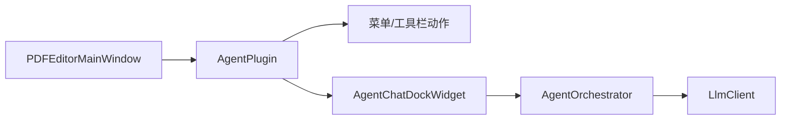
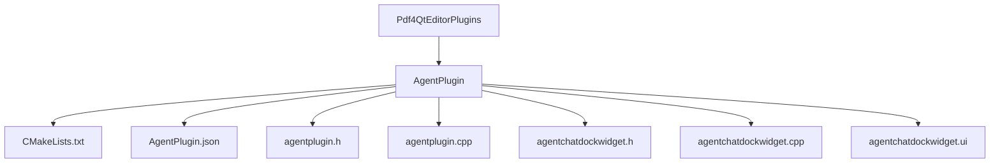
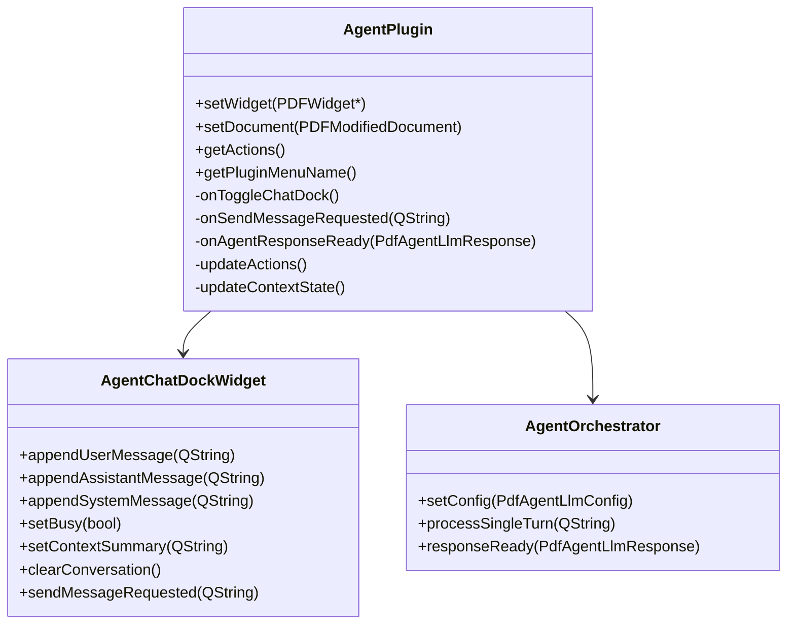
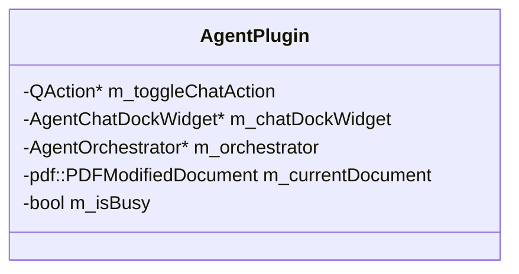
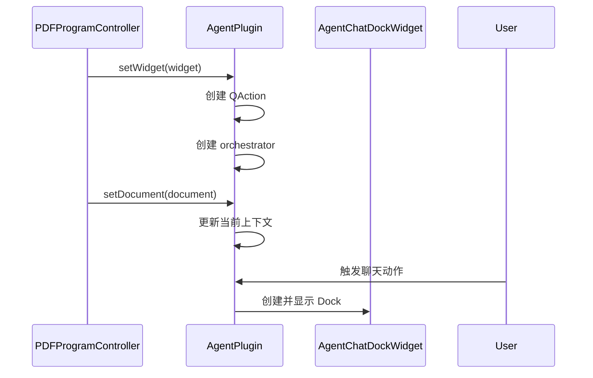
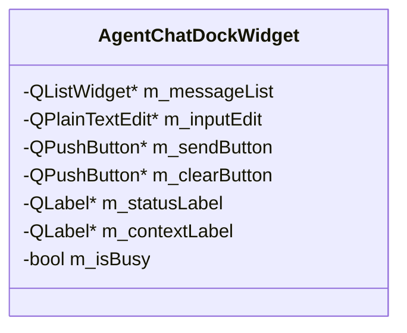
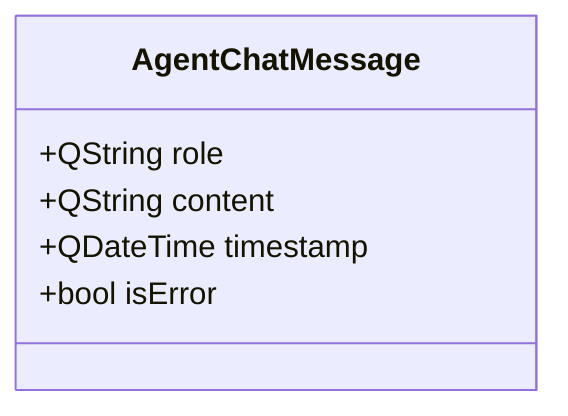
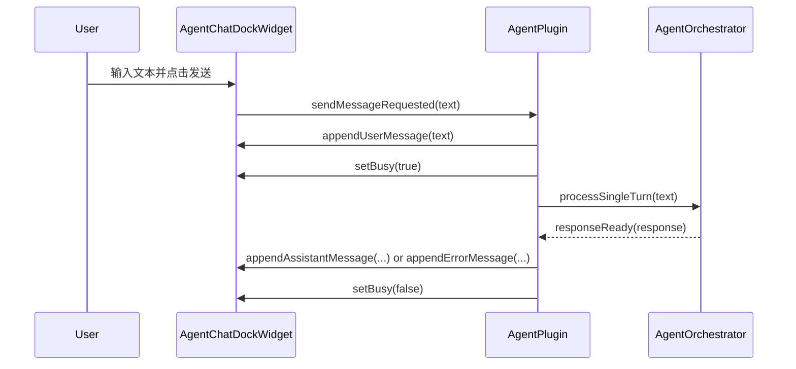
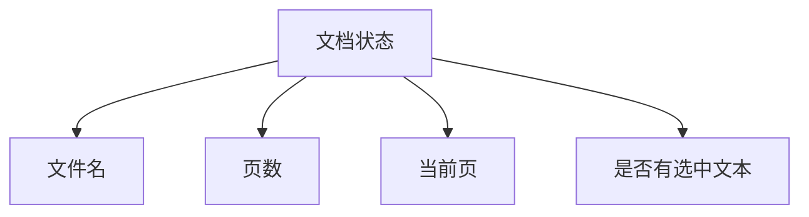
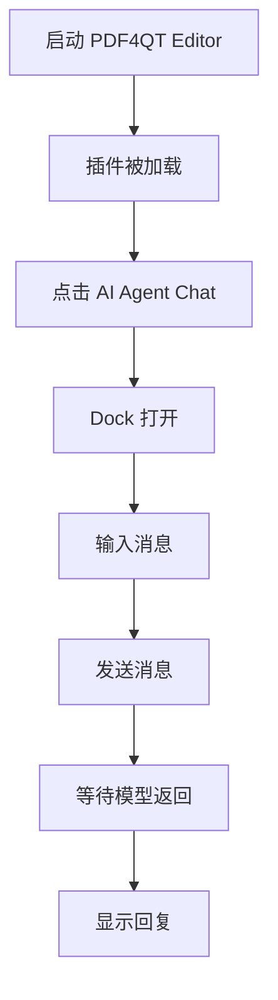

# PDF4QT AI Agent 第二阶段技术设计

## 文档目标

本文档定义 AI Agent 第二阶段的技术设计，核心目标是为 `PDF4QT Editor` 增加一个可用的聊天交互界面，并把它以插件的方式接入现有系统。

第二阶段建立在第一阶段网络能力之上，但仍然不引入真实工具调用。重点是：

- 引入 `AgentPlugin`
- 增加聊天 Dock 界面
- 对接第一阶段的 `AgentOrchestrator`
- 复用现有 `PDFPlugin` 生命周期
- 为第三阶段的命令路由预留扩展点

## 第二阶段范围

### 本阶段包含

- 新建 `AgentPlugin`
- 新建聊天 Dock Widget
- 设计消息列表和会话内存模型
- 将用户输入转交给 `AgentOrchestrator`
- 把模型回复展示到 UI
- 展示最小文档上下文状态

### 本阶段不包含

- 真实 tool calling
- `PdfFunctionRegistry`
- 文档修改类命令
- 正式设置页面
- 多会话管理

## 设计原则

### 插件优先

第二阶段优先使用插件，而不是直接修改 `PDFEditorMainWindow` 主体结构。

原因：

1. 现有项目已经有成熟插件加载机制
2. 插件可以复用 `setWidget()` 与 `setDocument()` 生命周期
3. AI 功能仍处于迭代期，插件方式更容易调整

### UI 采用 Dock 形态

聊天界面应使用 `QDockWidget` 或基于其实现的自定义 Dock Widget，原因如下：

- 与现有编辑器交互模式一致
- 可停靠、可隐藏
- 不会破坏主视图布局
- 与未来插件菜单动作天然兼容

## 目标结构



## 目录与文件规划

建议新增目录：



## 插件层设计

## 插件职责

`AgentPlugin` 只负责插件接入与 UI 生命周期，不负责网络细节。

它的职责应该限制为：

- 创建菜单动作
- 控制 Dock 的显示和隐藏
- 在文档变化时刷新上下文状态
- 在用户点击发送时调用 `AgentOrchestrator`
- 接收 orchestrator 的结果并更新 UI

## 类关系



## `AgentPlugin` 设计

## 插件元数据

建议新增 `AgentPlugin.json`：

```json
{
  "Name" : "AI Agent",
  "Author" : "PDF4QT Contributors",
  "Version" : "0.1.0",
  "License" : "LGPL v3",
  "Description" : "Interactive AI assistant dock for chat-based PDF workflows."
}
```

这个风格与现有插件元数据一致。

## 插件类职责

### 主要成员建议



### 插件生命周期



### 关键方法

建议实现以下方法：

- `setWidget(pdf::PDFWidget* widget)`
- `setDocument(const pdf::PDFModifiedDocument& document)`
- `getActions() const`
- `getPluginMenuName() const`
- `onToggleChatDock()`
- `onSendMessageRequested(const QString& text)`
- `onAgentResponseReady(const PdfAgentLlmResponse& response)`
- `updateActions()`
- `updateContextState()`

## 创建 Dock 的策略

建议采用懒加载：

- 插件初始化时不立即创建 Dock
- 用户第一次点击动作时创建
- 后续重复使用同一个 Dock

理由：

- 减少启动时 UI 负担
- 插件未使用时不创建额外控件
- 与现有一些插件的按需使用习惯一致

## 插件动作设计

### 建议动作

第二阶段只保留一个核心动作：

- `Open AI Agent Chat`

可选扩展动作：

- `Clear Conversation`

但建议先把“清空会话”放在 Dock 内部按钮，不急着暴露成插件菜单动作。

### 动作命名建议

- 对象名：`actionAgentPlugin_OpenChat`
- 文案：`tr("AI &Agent Chat")`

### 菜单归属

建议 `getPluginMenuName()` 返回：

- `tr("AI &Agent")`

这样它会进入现有插件系统所创建的工具菜单子项。

## 启用规则

第二阶段建议动作在以下情况下可用：

- 有 `m_widget`

Dock 打开后，即便没有文档也可以继续聊天，但应该显示“当前没有打开 PDF 文档”的上下文状态。

因此不要把整个插件动作绑定成“必须有文档才可点击”。否则聊天功能会被不必要限制。

## 聊天 Dock 设计

## UI 布局目标

建议采用简单稳定的三段式布局：


### 顶部区域

展示最小上下文状态：

- 当前文件名
- 是否有文档
- 页数
- 当前页
- 是否存在选中文本

第二阶段这里以摘要文本显示即可，不需要做复杂卡片。

### 中间区域

消息流视图建议选以下两种方案之一：

1. `QListWidget`
2. `QTextBrowser`

第二阶段推荐 `QListWidget`，理由：

- 更容易插入结构化消息项
- 后面扩展 `tool` 消息更自然
- 便于区分用户、助手、系统消息样式

### 底部区域

建议包含：

- 多行输入框 `QPlainTextEdit`
- 发送按钮
- 清空按钮
- 状态标签

可选：

- 停止按钮

第二阶段如未支持中断请求，可以先不实现停止按钮。

## Dock 类设计

### 建议成员



### 建议公开接口

- `appendUserMessage(const QString&)`
- `appendAssistantMessage(const QString&)`
- `appendSystemMessage(const QString&)`
- `appendErrorMessage(const QString&)`
- `setBusy(bool)`
- `setContextSummary(const QString&)`
- `clearConversation()`

### 建议信号

- `sendMessageRequested(const QString& text)`
- `clearRequested()`

## 消息展示模型

## 第二阶段消息类型



建议 `role` 限制为：

- `system`
- `user`
- `assistant`
- `error`

第三阶段再引入：

- `tool`

## UI 展示规则

建议消息前缀统一：

- `User`
- `Assistant`
- `System`
- `Error`

例如：

```text
User: 提取一下第一页的文字
Assistant: 当前阶段还未接入工具调用，但我已经收到请求。
```

第二阶段不需要复杂气泡布局，先保证信息清晰、实现稳定。

## 发送消息流程



## 忙碌状态规则

当请求进行中时：

- 禁用发送按钮
- 禁用输入框，或至少阻止重复发送
- 状态栏显示 `Thinking...`

请求完成后：

- 恢复输入
- 状态栏显示完成或错误信息

## 上下文摘要设计

## 为什么要做上下文摘要

第二阶段虽然不做工具调用，但用户需要知道 AI 当前看到的是哪份文档环境。

这可以降低误解，并为第三阶段命令调用做铺垫。

## 摘要内容建议



### 数据来源

建议数据来源：

- 文件名：`m_dataExchangeInterface->getOriginalFileName()`
- 选中文本：`m_dataExchangeInterface->getSelectedText()`
- 当前页：可从 `m_widget->getDrawWidget()->getCurrentPages()` 获取
- 页数：从 `m_document->getCatalog()->getPageCount()` 获取

### 没有文档时

显示：

```text
No document loaded.
```

### 有文档时

显示类似：

```text
File: example.pdf | Pages: 12 | Current page: 3 | Selected text: Yes
```

## 与第一阶段的对接方式

## Orchestrator 使用方式

`AgentPlugin` 应持有一个 `AgentOrchestrator` 实例。

建议流程：

1. 在 `setWidget()` 或构造后创建 orchestrator
2. 从配置中读取 `PdfAgentLlmConfig`
3. 用户发送消息时调用 `processSingleTurn(text)`
4. 订阅 `responseReady(...)`

## 阶段边界控制

第二阶段不要在插件层直接拼 HTTP 请求。

插件层只关心：

- UI 输入输出
- 忙碌状态
- 文档上下文显示

## 状态同步设计

## 文档变化

当 `setDocument(...)` 被调用时：

- 更新 `m_currentDocument`
- 刷新 Dock 上下文摘要
- 不清空聊天历史

原因：

- 用户可能希望保留上下文会话
- 聊天历史是否自动清空，后续可变成设置项

### 可选提示

如果文档发生重置，Dock 可追加一条系统消息：

```text
System: Active document changed.
```

这不是强制项，但有助于避免用户误判。

## 插件销毁

当插件销毁时：

- 由 Qt 对象树销毁 orchestrator
- 如 Dock 已创建，连同主窗口对象树一起销毁

不要做额外复杂的手工释放逻辑。

## 最小 UI 行为规范

### 输入规则

- 空白字符串不能发送
- 超长文本第二阶段不做裁剪，但可以保留基础长度警告

### 回车规则

建议：

- `Ctrl+Enter` 发送
- `Enter` 换行

这样更适合多行输入框。

### 清空规则

点击清空后：

- 清除消息列表
- 保留上下文摘要
- 不影响当前文档状态

## 第二阶段构建改动

## `Pdf4QtEditorPlugins/CMakeLists.txt`

需要新增：

- `add_subdirectory(AgentPlugin)`

## `Pdf4QtEditorPlugins/AgentPlugin/CMakeLists.txt`

建议结构与现有插件一致：

- `add_library(AgentPlugin SHARED ...)`
- `target_link_libraries(... Pdf4QtLibCore Pdf4QtLibGui Pdf4QtLibWidgets Qt6::Core Qt6::Gui Qt6::Widgets)`
- 安装到现有插件目录

### 依赖说明

因为第二阶段要直接调用第一阶段的 `AgentOrchestrator`，所以插件应链接 `Pdf4QtLibGui`。

## 第二阶段测试方案

## 手工验证路径



### 重点验证项

- 插件能否被正常发现并加载
- 菜单动作是否出现
- Dock 是否能正常显示和隐藏
- 没有 PDF 文档时是否能正常工作
- 打开 PDF 后上下文摘要是否刷新
- 消息是否按顺序显示
- 错误状态是否清晰

## 推荐单元测试边界

第二阶段 UI 很重，不适合一开始做复杂 UI 自动化。

更建议测试这些逻辑边界：

- 输入为空时不发送
- busy 状态是否正确切换
- 上下文摘要字符串拼接逻辑

如果需要，可把上下文摘要生成逻辑提取为纯函数，便于单测。

## 第二阶段完成标准

第二阶段完成的判定条件：

- 新插件 `AgentPlugin` 可被系统加载
- 用户可通过菜单动作打开聊天 Dock
- 用户可发送文本消息
- 第一阶段网络层可返回文本并显示在 Dock 中
- 文档上下文摘要会随当前文档刷新
- 整个流程在无文档和有文档两种状态下都能稳定运行

## 进入第三阶段前的要求

只有在以下条件满足后，才应进入第三阶段：

- UI 和网络闭环稳定
- 插件生命周期没有明显问题
- 用户消息和模型回复显示正常
- 文档上下文状态展示准确

完成这些后，第三阶段再引入：

- `PdfFunctionRegistry`
- mock tool call
- AI 输出到 PDF 内部能力调用的路由闭环
