# PDF4QT AI Agent 第三阶段技术设计

## 文档目标

本文档定义 AI Agent 第三阶段的技术设计，重点解决以下问题：

- 如何把 AI 的结构化输出安全地路由到内部 PDF 能力
- 如何定义命令注册表与执行上下文
- 如何在不依赖真实 tool calling 的前提下，通过 mock 方式验证整条调用链
- 如何约束命令边界，避免一开始暴露过多危险能力

第三阶段是整个 AI Agent 体系最关键的中间层。它不解决真实网络问题，也不解决复杂 UI，而是建立“可控调用内部能力”的基础结构。

## 第三阶段范围

### 本阶段包含

- 新建 `PdfFunctionRegistry`
- 新建命令描述结构
- 新建执行上下文结构
- 设计 mock tool call 协议
- 打通 `Chat UI -> Orchestrator -> Registry -> 内部命令 -> UI`
- 首批只读命令接入

### 本阶段不包含

- 真实模型返回 tool_calls 的协议兼容
- 修改类 PDF 命令
- 多轮工具编排
- 权限确认弹窗

## 阶段定位

如果说：

- 第一阶段解决“能不能连上模型”
- 第二阶段解决“用户能不能像聊天一样使用它”

那么第三阶段解决的是：

- “AI 的输出能不能以可维护、可控、可扩展的方式调用内部能力”

## 第三阶段总体结构

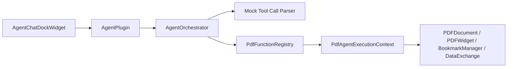

## 为什么先做 Mock Tool Call

第三阶段不应直接绑定真实 LLM tool calling，有三个原因：

1. 真实 provider 的工具调用协议有差异
2. 网络问题会干扰命令层设计验证
3. 工具路由本身是独立复杂度，应该先单独跑通

因此第三阶段要先证明一件事：

“只要 AI 给我一个结构化命令，我就能安全地解析、校验、执行并把结果返回给 UI。”

## 建议目录与文件

建议核心逻辑继续放到 `Pdf4QtLibCore/agent/` 下：

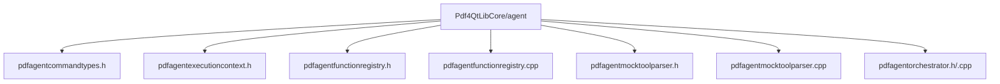

其中：

- `mock parser` 是第三阶段临时组件
- `function registry` 和 `execution context` 会进入第四阶段继续使用

## 总体职责划分

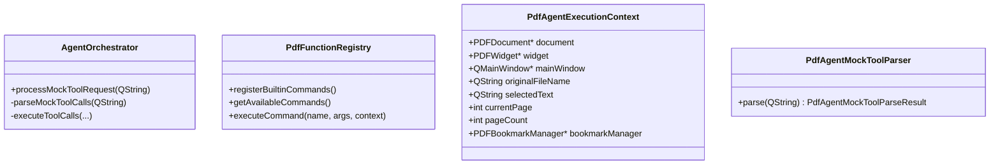

## 核心设计原则

### 原则一：命令必须显式注册

不允许通过字符串直接映射任意内部函数。所有能力都必须先注册，再执行。

### 原则二：命令只拿上下文，不拥有资源

命令不负责拥有或管理 `PDFDocument` 生命周期，只消费当前执行上下文。

### 原则三：第三阶段只开放只读命令

第三阶段只允许读取文档信息，不允许修改文档内容。

### 原则四：参数必须做校验

命令调用不是“拿到 JSON 就执行”，必须先做：

- 命令名检查
- 参数存在性检查
- 参数类型检查
- 文档状态检查

### 原则五：返回值统一 JSON 化

所有命令执行结果统一返回 `QJsonObject`，这样第四阶段接入真实 tool calling 时格式最稳定。

## 执行上下文设计

## 为什么需要执行上下文

原始 UML 中的 `currentDoc` 太窄了。实际执行命令时，不仅要文档，还需要：

- 当前 UI 主窗口
- 当前页
- 当前选中文本
- 当前文件名
- 书签管理器

因此第三阶段引入 `PdfAgentExecutionContext`。

## 建议结构

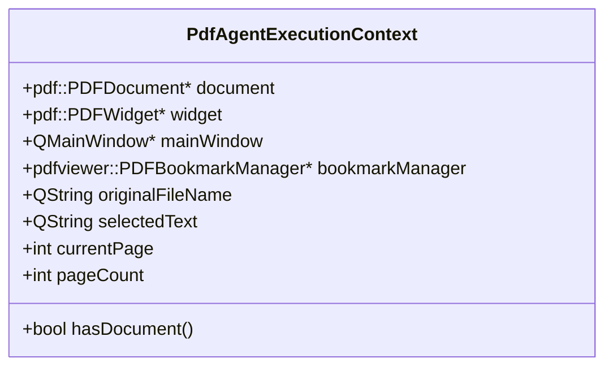

## 字段来源建议

### `document`

来源：

- 插件收到的 `setDocument(const pdf::PDFModifiedDocument&)`

### `widget`

来源：

- 插件收到的 `setWidget(pdf::PDFWidget*)`

### `mainWindow`

来源：

- `m_dataExchangeInterface->getMainWindow()`

### `originalFileName`

来源：

- `m_dataExchangeInterface->getOriginalFileName()`

### `selectedText`

来源：

- `m_dataExchangeInterface->getSelectedText()`

注意这里 `PDFTextSelection` 需要在上下文构建时转换成适合命令使用的纯文本字符串。

### `currentPage`

来源：

- `m_widget->getDrawWidget()->getCurrentPages()`

规则：

- 没有页时记为 `-1`
- 有页时取当前显示页数组的第一个值

### `pageCount`

来源：

- `m_document->getCatalog()->getPageCount()`

### `bookmarkManager`

来源：

当前插件接口 `IPluginDataExchange` 并没有直接暴露 `PDFBookmarkManager`。因此第三阶段建议有两种路径：

1. 先在 `AgentPlugin` 里不做书签命令
2. 或者在后续小改动里为 `IPluginDataExchange` 增加书签管理器访问接口

**推荐方案**

第三阶段文档里把书签命令保留为“可选首批命令”，但真实实现优先做不依赖书签管理器的命令。

## 命令注册表设计

## 目标

命令注册表负责统一管理：

- 命令名
- 命令描述
- 参数 schema
- 执行函数
- 命令元信息

## 关键类设计

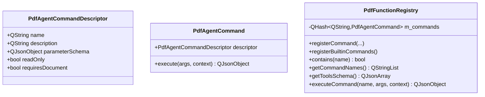

## 为什么需要 `descriptor`

把描述信息和执行逻辑拆开有两个好处：

1. 第四阶段可以直接把 `descriptor` 导出成 tools schema
2. 第五阶段可以基于 `readOnly` 与 `requiresDocument` 做权限判断

## 命令函数签名建议

第三阶段不建议过早引入复杂模板和 concept。先用直接、稳定的 Qt/C++ 签名。

建议统一为：

```cpp
using PdfAgentCommandHandler =
    std::function<QJsonObject(const QJsonObject& args,
                              const PdfAgentExecutionContext& context)>;
```

## 为什么先不用协程

第三阶段命令都是本地只读能力，执行很快。用同步返回更容易：

- 简化调用链
- 降低调试难度
- 便于单元测试

如果未来出现长耗时命令，再专门演进异步执行模型。

## 参数 Schema 设计

第三阶段虽然还没接真实 tool calling，但建议从现在开始保持 schema 结构稳定。

### 示例：`extract_page_text`

```json
{
  "type": "object",
  "properties": {
    "page": {
      "type": "integer",
      "description": "Zero-based page index."
    }
  },
  "required": ["page"]
}
```

### 第三阶段的作用

此 schema 在第三阶段主要有两个用途：

1. 作为文档化和调试信息
2. 为第四阶段 `getToolsSchema()` 直接复用

## 首批命令设计

第三阶段应只开放只读命令。

## 必做命令

### `get_document_summary`

用途：

- 返回当前文档基础摘要信息

建议返回：

```json
{
  "ok": true,
  "file_name": "example.pdf",
  "page_count": 12,
  "current_page": 2,
  "has_selected_text": true
}
```

### `get_current_page`

用途：

- 返回当前页索引与页号

建议返回：

```json
{
  "ok": true,
  "page_index": 2,
  "page_number": 3
}
```

### `extract_selected_text`

用途：

- 返回当前选中文本

建议返回：

```json
{
  "ok": true,
  "text": "selected text here"
}
```

若无选中文本：

```json
{
  "ok": false,
  "error": "No text is currently selected."
}
```

## 可选命令

### `extract_page_text`

这是高价值命令，但实现前要先确认项目里是否已有稳定的“按页提取纯文本”的现成接口可直接复用。如果没有，则第三阶段文档中可先定义接口，但真实实现推迟到后续。

### `list_bookmarks`

如果能拿到 `PDFBookmarkManager*`，则可返回：

```json
{
  "ok": true,
  "bookmarks": [
    {
      "name": "Chapter 1",
      "page_index": 0,
      "is_auto": true
    }
  ]
}
```

否则此命令在第三阶段先不落地。

## 命令返回格式规范

建议所有命令统一使用：

- `ok`
- 成功结果字段
- 或 `error`

### 成功样例

```json
{
  "ok": true,
  "page_count": 10
}
```

### 失败样例

```json
{
  "ok": false,
  "error": "Command requires an active document."
}
```

这样可以减少 orchestrator 的分支复杂度。

## Mock Tool Call 协议设计

## 第三阶段为什么需要一个 parser

为了模拟未来模型返回的工具调用，第三阶段需要一个明确的 mock 输入协议。

这个协议应尽量接近第四阶段的真实结构，但不要过早绑定某一家 provider。

## 推荐输入格式

推荐使用 JSON 文本，支持单调用和多调用。

### 单调用

```json
{
  "tool_calls": [
    {
      "name": "get_document_summary",
      "arguments": {}
    }
  ]
}
```

### 多调用

```json
{
  "tool_calls": [
    {
      "name": "get_document_summary",
      "arguments": {}
    },
    {
      "name": "extract_selected_text",
      "arguments": {}
    }
  ]
}
```

## 解析结果类型

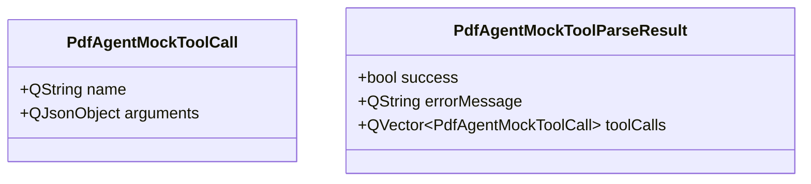

## 解析规则

mock parser 应验证：

1. 输入是合法 JSON
2. 顶层对象存在 `tool_calls`
3. `tool_calls` 是数组
4. 每个元素存在 `name`
5. `arguments` 若不存在则默认空对象
6. `arguments` 必须是对象

## Orchestrator 在第三阶段的职责变化

第三阶段开始，`AgentOrchestrator` 不再只是发文本请求，它还要支持 mock 路由模式。

## 推荐新增职责

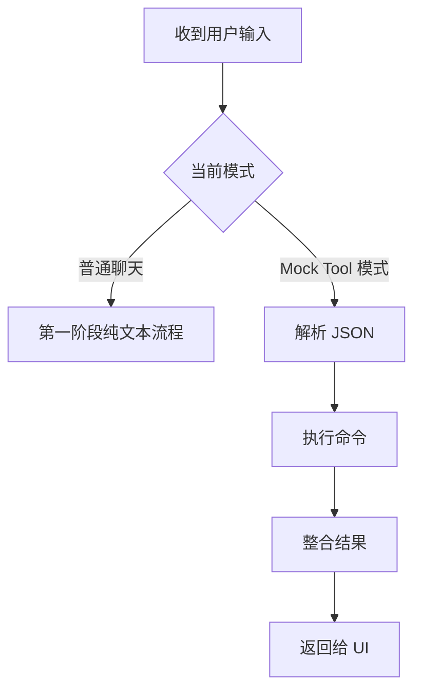

## 推荐接口

建议新增：

- `processMockToolRequest(const QString& mockJsonText, const PdfAgentExecutionContext& context)`

返回结果可以继续复用统一响应结构，也可以新增一个专用结果结构。

更推荐新增专用结构，避免把命令结果硬塞进纯文本响应里。

## 建议结果结构

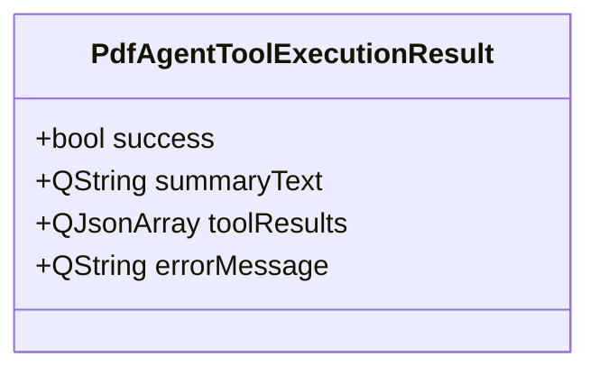

### `summaryText` 用途

给 UI 一段便于展示的自然文本，例如：

```text
Executed 2 tool calls successfully.
```

### `toolResults`

保留结构化结果，便于第四阶段回传给模型。

## 第三阶段调用流程

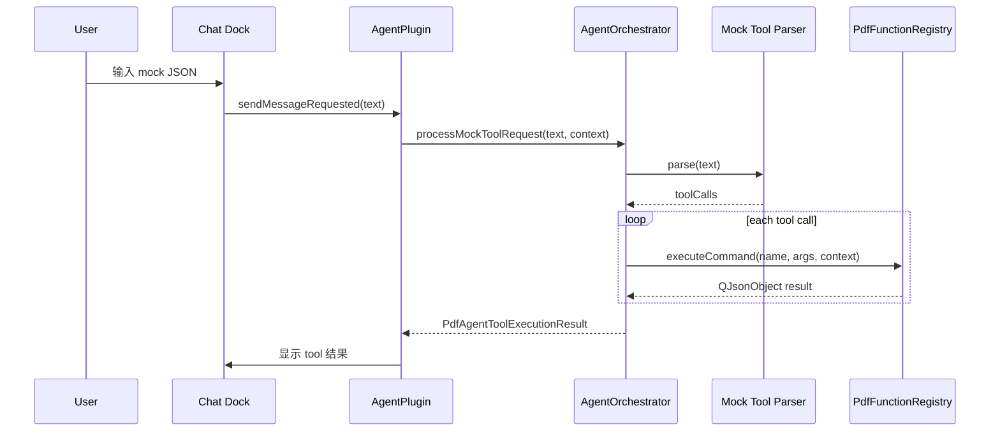

## UI 层在第三阶段的建议变化

第二阶段的聊天 UI 已经可以发送文本。第三阶段建议只做很小的 UI 变化：

### 方案 A

增加一个 debug/mock 模式切换

例如：

- `Normal Chat`
- `Mock Tool`

### 方案 B

不改 UI 模式，只约定：

- 当输入内容是合法 mock JSON 时，走 mock tool 流程
- 否则走普通聊天流程

**推荐方案**

第三阶段优先使用方案 A。原因是行为更可控，避免歧义。

## 命令校验规则

## 注册表级别校验

执行前必须检查：

- 命令是否存在
- 若命令要求文档，当前上下文是否有文档

## 命令级别校验

每个命令内部必须检查：

- 必填参数是否存在
- 参数类型是否正确
- 参数值是否在合法范围内

例如页码：

- 不得小于 0
- 不得大于等于 `pageCount`

## 错误返回规范

若命令不存在：

```json
{
  "ok": false,
  "error": "Unknown command: extract_page_text"
}
```

若缺少文档：

```json
{
  "ok": false,
  "error": "Command requires an active document."
}
```

若参数非法：

```json
{
  "ok": false,
  "error": "Parameter 'page' must be an integer between 0 and 11."
}
```

## 安全边界

第三阶段必须明确只读边界。

## 明确禁止的内容

第三阶段不允许注册：

- 保存文档
- 加水印
- 删除链接
- 增删注释
- 创建书签
- 编辑页面内容

## 原因

第三阶段的目标是建立“路由层正确性”，而不是“自动修改文档”。修改类命令会引入：

- 用户确认流程
- 回滚与 undo 行为
- 更复杂的权限边界

这些应放到第五阶段。

## 第三阶段推荐测试

## 单元测试重点

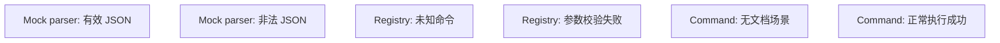

## 推荐测试文件

建议新增：

- `UnitTests/tst_pdfagentmocktoolparser.cpp`
- `UnitTests/tst_pdfagentfunctionregistry.cpp`

## 手工验证路径

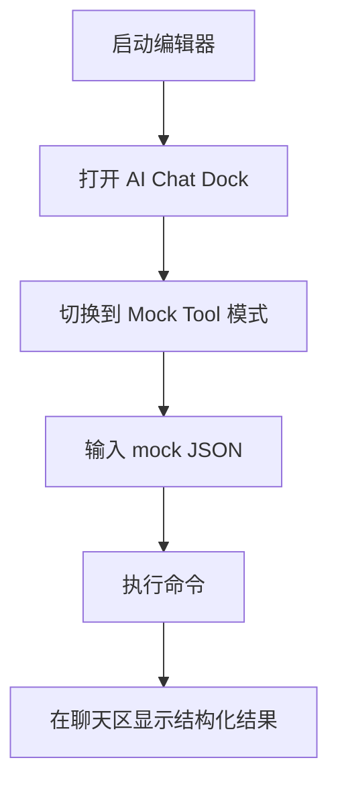

### 最小手工验证样例

样例一：

```json
{
  "tool_calls": [
    {
      "name": "get_document_summary",
      "arguments": {}
    }
  ]
}
```

样例二：

```json
{
  "tool_calls": [
    {
      "name": "extract_selected_text",
      "arguments": {}
    }
  ]
}
```

样例三，错误路径：

```json
{
  "tool_calls": [
    {
      "name": "unknown_command",
      "arguments": {}
    }
  ]
}
```

## 对第四阶段的铺垫

第三阶段设计中，以下能力应直接复用于第四阶段：

- `PdfAgentExecutionContext`
- `PdfFunctionRegistry`
- `CommandDescriptor`
- `getToolsSchema()`
- 统一 JSON 结果格式

第四阶段只需要替换输入源：

- 第三阶段：mock JSON
- 第四阶段：真实 LLM 返回的 tool calls

## 第三阶段完成标准

第三阶段完成时，应满足：

- 已有 `PdfFunctionRegistry`
- 已有至少 2 到 3 个可用只读命令
- 已有 mock tool parser
- 已能从聊天 UI 触发 mock command execution
- 错误命令、错误参数、无文档场景能安全处理
- 命令结果能结构化返回并展示

## 进入第四阶段前的要求

只有满足以下条件，才应进入第四阶段：

- 命令注册与执行链稳定
- 执行上下文结构足够清晰
- mock tool 调用成功验证
- 只读命令边界明确

在这之后，第四阶段才去接真实 provider 的 `tool_calls`，把模型调用与内部命令系统正式打通。
