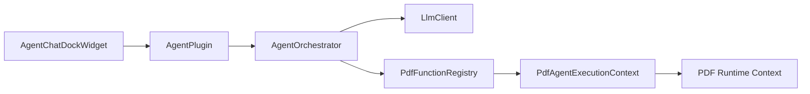
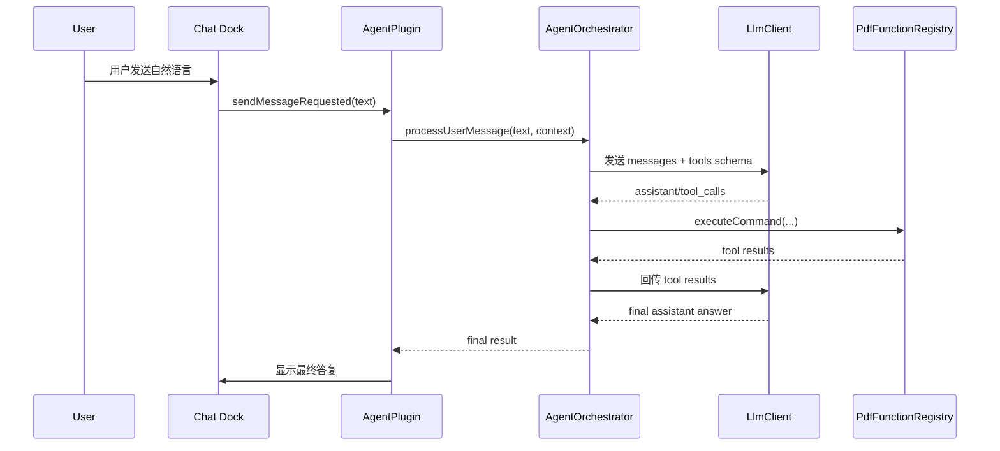
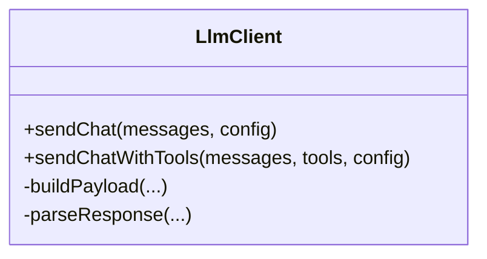
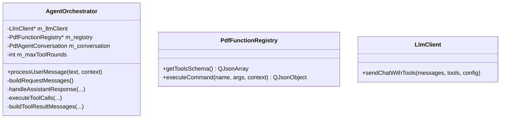
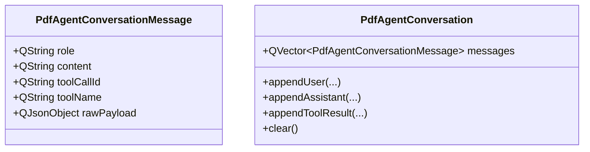
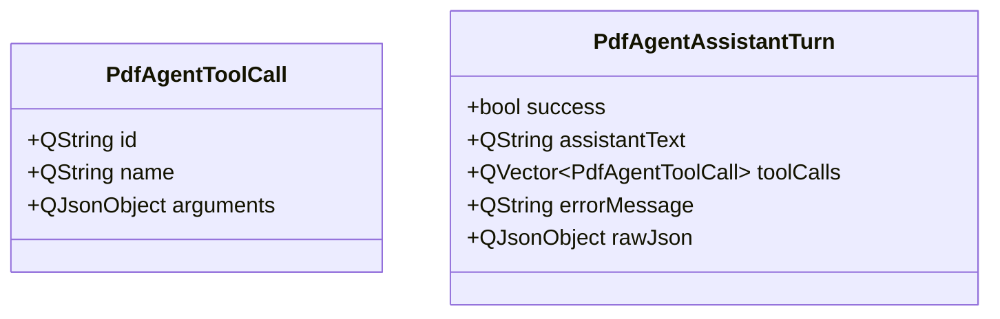
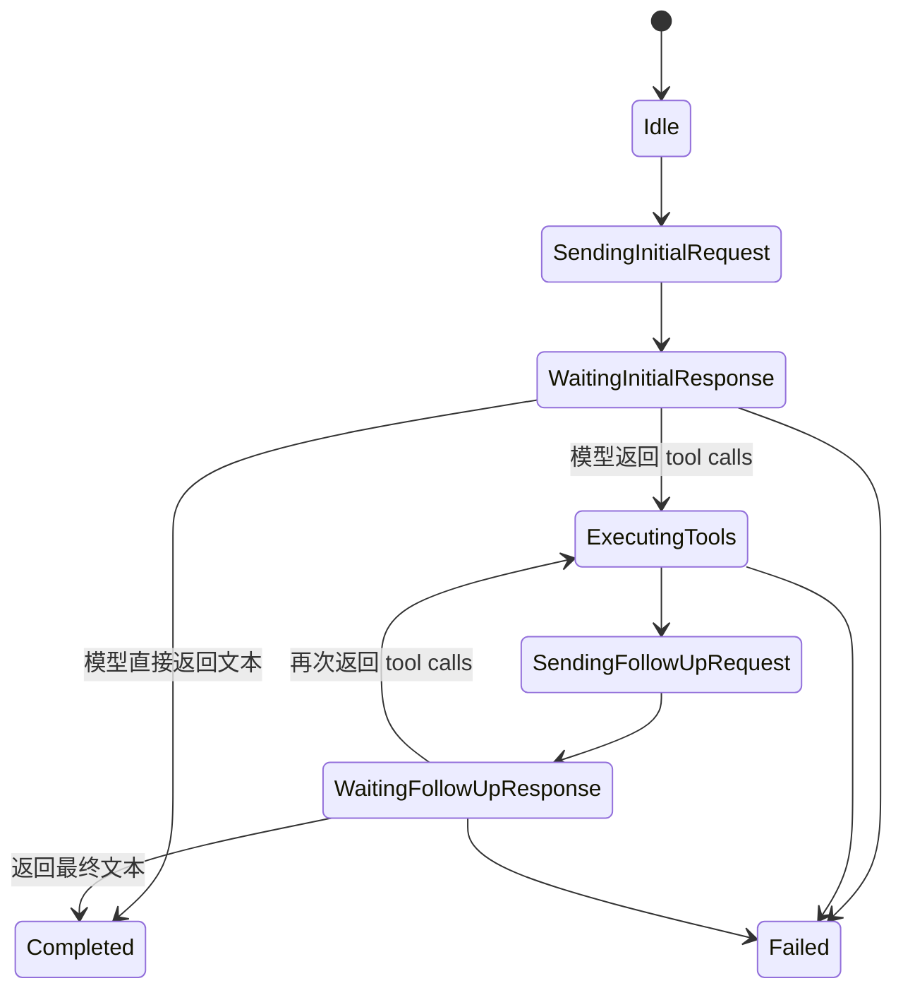
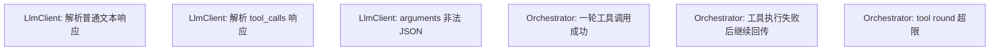
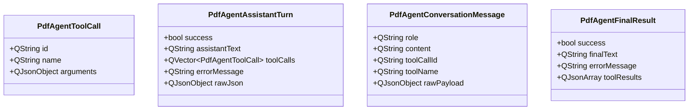

# PDF4QT AI Agent 第四阶段技术设计

## 文档目标

本文档定义 AI Agent 第四阶段的技术设计，目标是把真实模型工具调用与本地命令系统正式打通。

第四阶段建立在前三阶段基础之上：

- 第一阶段已经在 `Pdf4QtLibCore` 中打通基础网络调用
- 第二阶段已经有聊天 UI
- 第三阶段已经完成 mock tool call 与命令注册表

第四阶段要解决的是：

- 如何把真实模型返回的 tool call 解析出来
- 如何把 tool call 安全地映射到本地命令
- 如何把工具执行结果回传给模型
- 如何在多步调用后拿到最终自然语言答复

## 第四阶段范围

### 本阶段包含

- 真实 tool calling 编排流程
- 将 `PdfFunctionRegistry` 导出为 tools schema
- 识别模型返回的 tool calls
- 执行本地命令
- 将 tool result 回传模型
- 获取最终 assistant 回复

### 本阶段不包含

- 修改类命令执行确认
- 高风险写操作
- 多 provider 完整兼容层
- 持久化会话管理

## 阶段核心问题

第三阶段已经证明：

“如果我拿到结构化命令，我可以调用内部能力。”

第四阶段要证明：

“我不仅能调用内部能力，还能和真实模型形成一个闭环，让模型自己决定何时调用工具，并在工具结果基础上生成最终答复。”

## 第四阶段总体结构



## 核心调用闭环



## 第四阶段设计原则

### 原则一：编排逻辑统一放在 `AgentOrchestrator`

插件层不负责：

- 判断是否要调用工具
- 执行工具
- 回传模型

插件层只负责：

- 发送用户消息
- 展示中间状态
- 展示最终结果

### 原则二：工具系统继续复用第三阶段结构

以下结构不应重写：

- `PdfAgentExecutionContext`
- `PdfFunctionRegistry`
- 命令描述和参数 schema
- 统一 JSON 结果格式

### 原则三：模型输出必须经过严格校验

模型返回的 tool calls 不能被直接信任，必须检查：

- 名称是否存在
- 参数是否为对象
- 是否超出工具轮数限制
- 是否命中危险命令

### 原则四：第四阶段仍以只读命令为主

第四阶段默认只开放第三阶段定义的只读命令。

修改类命令继续留到第五阶段。

## 核心组件变化

## `LlmClient` 的扩展职责

第一阶段的 `LlmClient` 只处理纯文本返回。第四阶段需要扩展到：

- 发送 tools schema
- 识别 tool call 响应
- 识别普通 assistant 文本响应

### 目标接口演进



## `AgentOrchestrator` 的扩展职责

第四阶段 `AgentOrchestrator` 要真正承担“智能编排器”角色。

它要负责：

1. 构造消息历史
2. 附带 tools schema 调用模型
3. 识别模型是否发起 tool call
4. 逐个执行工具
5. 把结果回传模型
6. 获取最终自然语言回答
7. 控制失败终止与轮数限制

## 建议类关系



## 会话消息模型升级

第四阶段开始，单轮消息已经不够，需要一个内部会话消息模型。

## 建议消息类型



## 角色约定

建议支持：

- `system`
- `user`
- `assistant`
- `tool`

说明：

- `tool` 角色用于把本地命令执行结果回传模型
- 这与第三阶段 UI 中的 `tool` 消息展示需求可自然对接

## Why 会话模型要现在引入

因为第四阶段的调用闭环至少包含：

1. 用户消息
2. 模型的 tool call 意图
3. 本地工具返回结果
4. 模型最终自然语言答复

如果没有稳定的消息模型，后面扩展会非常混乱。

## 工具 schema 导出设计

第三阶段的命令注册表已经具备：

- 名称
- 描述
- 参数 schema

第四阶段要把这些导出成模型可消费的 tools schema。

## 目标输出

```json
[
  {
    "type": "function",
    "function": {
      "name": "get_document_summary",
      "description": "Return basic information about the active document.",
      "parameters": {
        "type": "object",
        "properties": {},
        "required": []
      }
    }
  }
]
```

## 注册表接口

建议保留或新增：

- `QJsonArray getToolsSchema() const`

### 设计要求

- 输出结构固定
- 命令顺序稳定
- 不导出未启用或高风险命令

## 真实 tool call 响应解析

## 为什么要统一解析层

不同 provider 对 tool calling 的 JSON 结构可能存在差异，但当前阶段建议先围绕一个主协议实现。

优先支持 OpenAI-compatible 格式。

## 预期响应形态

概念上类似：

```json
{
  "choices": [
    {
      "message": {
        "role": "assistant",
        "content": null,
        "tool_calls": [
          {
            "id": "call_1",
            "type": "function",
            "function": {
              "name": "get_document_summary",
              "arguments": "{}"
            }
          }
        ]
      }
    }
  ]
}
```

## 解析目标结构

建议在 `LlmClient` 内部解析为统一结构：



## 解析规则

### 普通文本返回

若模型返回 assistant 文本，且没有 tool calls：

- `assistantText` 有值
- `toolCalls` 为空

### 工具调用返回

若模型返回 tool calls：

- `toolCalls` 有值
- `assistantText` 可为空

### 非法情况

若：

- arguments 不是合法 JSON
- tool name 为空
- tool_calls 结构畸形

则返回失败结果，不做执行。

## arguments 解析规则

很多 provider 会把 arguments 放成字符串 JSON。因此第四阶段必须支持：

- `function.arguments` 是 JSON 字符串
- 解析后得到 `QJsonObject`

若解析失败，应直接拒绝该 tool call。

## Orchestrator 编排状态机

第四阶段核心不在某个函数，而在状态机。

## 建议状态流转



## 编排算法建议

伪流程：

1. 把 system prompt 和用户消息加入 conversation
2. 带 tools schema 调用模型
3. 若返回普通文本，则结束
4. 若返回 tool calls，则逐个执行
5. 把每个 tool result 以 `tool` 消息追加进 conversation
6. 再次带完整 conversation 调用模型
7. 若返回文本，则结束
8. 若再次返回 tool calls，则重复，但次数受限

## 工具轮数限制

必须加限制，建议：

- `maxToolRounds = 3`

### 超限后的处理

若超过最大轮数：

- 直接失败
- 返回错误：

```text
Tool call round limit exceeded.
```

原因：

- 防止模型陷入循环
- 防止意外高频调用内部能力

## Tool Call 执行策略

## 是否允许单轮多工具

建议第四阶段支持“单轮多工具”：

- 按顺序执行
- 每个结果单独记录

### 执行顺序

如果模型同一轮返回多个 tool calls：

1. 逐个解析
2. 逐个执行
3. 每个结果都写入 conversation

### 出错策略

即便其中某个工具执行失败，也不必立刻中断整个轮次。更合理的策略是：

- 把失败结果也作为 tool result 回传模型
- 让模型决定是否继续或给出解释

## Tool Result 消息设计

## 为什么需要标准化

为了让模型可靠消费结果，tool result 不应该是随意拼接文本，而应该是稳定 JSON。

## 建议回传结构

```json
{
  "ok": true,
  "result": {
    "page_count": 10
  }
}
```

或失败：

```json
{
  "ok": false,
  "error": "No active document."
}
```

## 会话中的 tool 消息

建议在 conversation 中记录：

- `role = "tool"`
- `toolCallId`
- `toolName`
- `content = compact JSON string`

这样做的原因：

- 与 provider 常见协议接近
- 便于调试
- 便于 UI 展示中间过程

## UI 层在第四阶段的表现

第四阶段 UI 不需要做大改，但应支持展示“中间工具步骤”。

## 建议新增展示能力

- 展示 assistant 正在调用工具
- 展示 tool 执行结果摘要
- 最后展示 assistant 最终答复

### 推荐消息流

```text
User: 请总结当前文档
Assistant: 正在分析当前文档...
Tool: get_document_summary -> ok
Assistant: 当前文档共有 12 页，当前停留在第 3 页。
```

### 忙碌状态

整个第四阶段流程中，插件应保持 busy，直到：

- 获得最终文本答复
- 或流程失败

## 与现有主程序状态的关系

建议第四阶段的“AI 请求处理中”主要只影响 Agent UI 本身，不立即接管 `PDFProgramController::setIsBusy()` 的全局文档忙碌状态。

原因：

- AI 调用并不一定阻塞 PDF 编辑器其余功能
- 当前 `ProgramController` busy 语义主要面向文档读取和处理流程

### 可复用能力

仍可适度复用：

- `setStatusBarMessage(...)` 展示简短状态

例如：

- `AI Agent: contacting model...`
- `AI Agent: executing tool get_document_summary...`

但不要把整个编辑器动作全部禁用。

## 失败终止策略

第四阶段必须明确什么时候立即失败。

## 立即失败条件

以下情况建议直接终止本轮：

1. 初始网络请求失败
2. tool call JSON 结构无法解析
3. follow-up 请求失败
4. tool round 超限
5. provider 返回无法识别的消息结构

## 非立即失败条件

以下情况建议不中断整轮，而是回传失败 tool result：

1. 某个命令不存在
2. 某个命令参数非法
3. 当前无文档导致命令不能执行

原因：

- 这类错误模型有机会理解并改正
- 更符合 agent 闭环编排思路

## 日志与调试建议

第四阶段如果没有调试日志，后续排错会非常困难。

## 最小调试信息

建议记录：

- 初始请求消息数
- 导出的 tools 数量
- 模型返回是否包含 tool calls
- 每一轮 tool call 数量
- 每个 tool 名称
- 每个 tool 执行是否成功
- 当前轮数

### 注意事项

- 不要在日志中输出完整 API key
- 原始响应可在 debug 模式下截断输出

## 单元测试与集成测试建议

## 重点测试边界



## 推荐测试思路

最好把 `LlmClient` 的网络层和响应解析层适度分离，这样可以：

- 用假响应驱动 orchestrator 测试
- 不需要真实联网就验证编排逻辑

## 推荐假客户端策略

可在测试中提供一个 fake `LlmClient`：

- 第一次返回 tool_calls
- 第二次返回最终文本

这样能完整验证第四阶段主流程。

## 第四阶段最小手工验证用例

### 用例一：模型直接回答，不调用工具

目标：

- 验证普通文本路径没有被第四阶段破坏

### 用例二：模型调用 `get_document_summary`

目标：

- 验证单工具调用路径

### 用例三：模型调用 `extract_selected_text`

目标：

- 验证依赖当前选区的工具路径

### 用例四：模型返回不存在的命令

目标：

- 验证失败 tool result 是否能正常回传

### 用例五：模型连续多轮调用直到最终回答

目标：

- 验证 orchestrator 状态机

## 数据结构汇总



## 第四阶段完成标准

第四阶段完成的判定条件：

- `PdfFunctionRegistry` 可以导出真实 tools schema
- `LlmClient` 能解析 tool calls
- `AgentOrchestrator` 能完成“请求 -> 工具执行 -> 回传 -> 最终答复”的闭环
- 工具调用轮数有限制
- 错误命令和错误参数能安全处理
- UI 能展示最终答复与必要中间步骤

## 进入第五阶段前的要求

只有在以下条件满足后，才进入第五阶段：

- 真实 tool calling 已稳定运行
- 第四阶段仍只暴露只读命令
- 中间结果与最终结果都可被用户理解
- 循环调用和异常路径都已验证

达到这些条件后，第五阶段才可以引入：

- 修改类命令
- 用户确认弹窗
- 更严格的安全边界与交互保护
