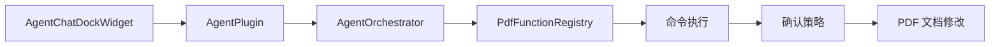
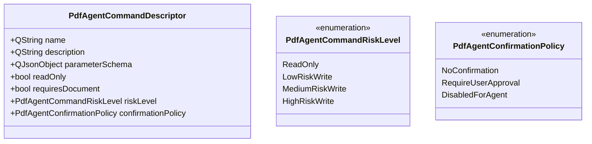
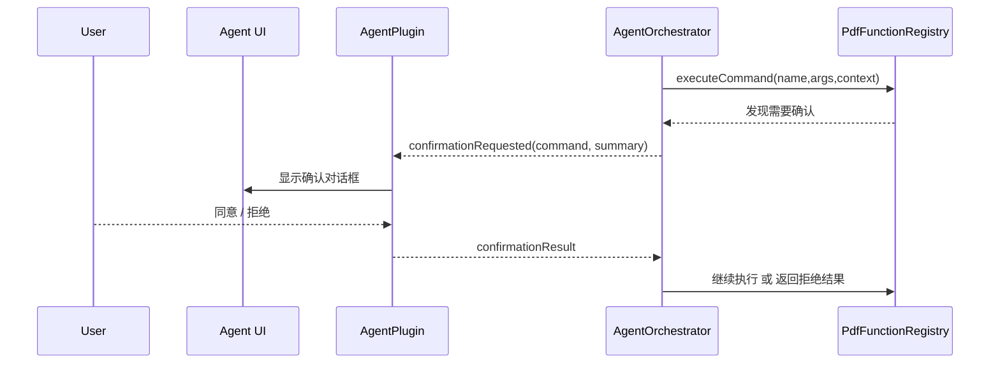
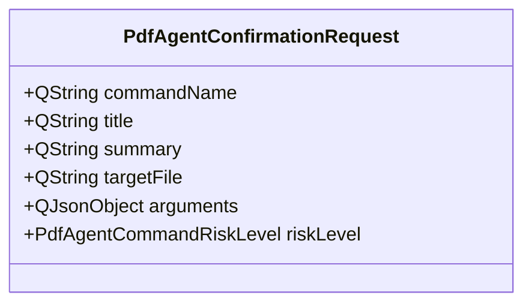
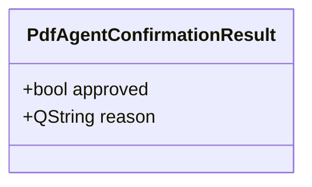
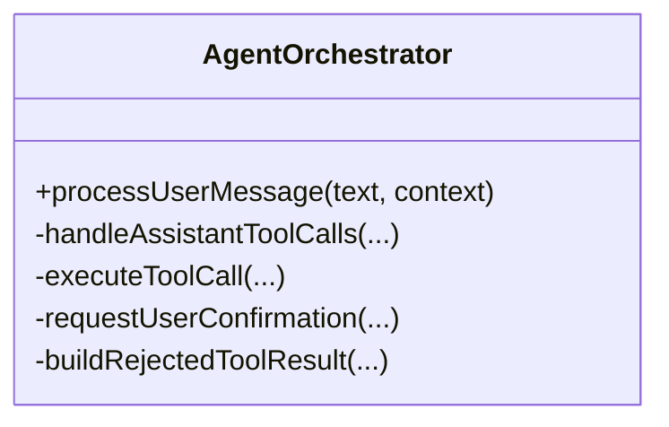
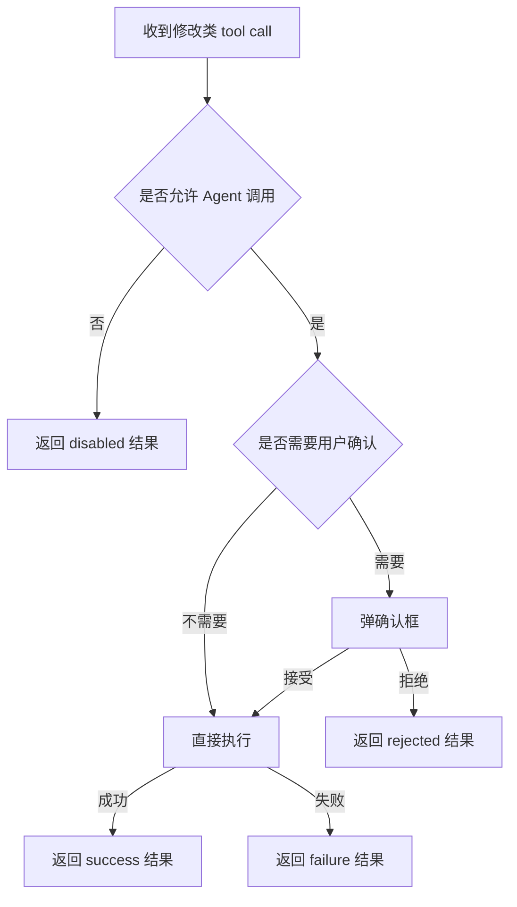
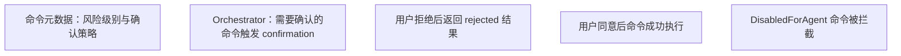

# PDF4QT AI Agent 第五阶段技术设计

## 文档目标

本文档定义 AI Agent 第五阶段的技术设计，目标是在已有只读工具调用闭环的基础上，引入“修改类命令”的安全执行机制。

第五阶段不只是“多几个命令”，而是正式引入：

- 修改类命令分类
- 用户确认机制
- 命令风险分级
- 失败回传策略
- 文档刷新与状态同步

这是 AI Agent 从“读文档”走向“改文档”的分水岭。

## 第五阶段范围

### 本阶段包含

- 为命令增加风险分类和确认策略
- 增加修改类命令的执行入口
- 在 UI 中增加确认对话流程
- 将用户的接受或拒绝结果回传给 orchestrator
- 在命令成功后刷新文档状态与聊天状态

### 本阶段不包含

- 完整权限系统
- 批量审批队列
- 多用户权限模型
- 复杂回滚系统

## 第五阶段核心原则

### 原则一：修改类命令必须默认不自动执行

模型提出修改请求，不等于系统立即执行。

### 原则二：命令风险应显式建模

不要只靠 `requiresConfirmation` 一个布尔字段。第五阶段建议引入命令风险级别或执行策略字段。

### 原则三：确认结果必须进入会话链路

用户点“同意”或“拒绝”，不是 UI 私有状态，而应成为 agent 流程的一部分。

### 原则四：失败也必须结构化

不论是用户拒绝、命令失败还是参数错误，都要用统一结构返回给模型与 UI。

## 总体结构



## 命令元数据升级

第三阶段与第四阶段的命令描述结构还不够表达修改类能力。第五阶段建议把命令元数据升级。

## 新的命令描述结构



## 为什么不只用 `readOnly`

因为真实场景中至少有三种状态：

1. 只读，可直接执行
2. 可写，但必须确认
3. 风险过高，暂时根本不允许 Agent 调用

## 第五阶段命令分类

## 第一批建议开放的修改类命令

建议选择那些：

- 修改边界清晰
- 影响面相对单一
- 项目里已有成熟执行能力

推荐首批：

- `create_bookmark`
- `remove_external_links`
- `save_document_as`

### 暂缓命令

以下命令建议继续延后：

- `add_watermark`
- 大范围页面内容编辑
- 批量注释写入
- 大范围对象结构修改

原因是它们对回滚、预览、用户理解成本更高。

## 命令风险建议

### `create_bookmark`

- 风险级别：`LowRiskWrite`
- 确认策略：`RequireUserApproval`

### `remove_external_links`

- 风险级别：`MediumRiskWrite`
- 确认策略：`RequireUserApproval`

### `save_document_as`

- 风险级别：`MediumRiskWrite`
- 确认策略：`RequireUserApproval`

### 暂不开放的高风险命令

- 风险级别：`HighRiskWrite`
- 确认策略：`DisabledForAgent`

## 确认机制设计

## 为什么确认逻辑不能放在命令内部

如果每个命令内部自己弹窗，会导致：

- 行为不一致
- orchestrator 无法知道用户是“拒绝”还是“执行失败”
- 第四阶段的闭环消息链断裂

因此确认机制应当由 orchestrator 或插件层统一调度。

## 推荐流程



## 建议的确认请求结构



## 确认对话框内容

必须展示：

- 命令名称
- 自然语言摘要
- 目标文件或当前文档
- 主要参数
- 风险提示

### 示例

```text
AI Agent 想要执行以下操作：
删除当前文档中的外部链接注释

目标文件：example.pdf
风险级别：中等

是否继续？
```

## 用户选择后的结果结构



### 拒绝时的推荐 reason

- `User rejected the operation.`

## Registry 与执行器的职责分工

第五阶段不建议把确认逻辑直接塞进 registry 本体。更合理的划分是：

### `PdfFunctionRegistry`

负责：

- 查找命令
- 提供命令描述
- 执行命令处理器

### `AgentOrchestrator`

负责：

- 判断命令是否需要确认
- 触发确认流程
- 根据确认结果决定是否调用 registry

这样可以保持 registry 的单一职责。

## Orchestrator 的第五阶段扩展



## 拒绝结果如何回传模型

用户拒绝不是异常，而是一个合法业务结果。

因此建议回传：

```json
{
  "ok": false,
  "error": "User rejected the operation."
}
```

这样模型可以理解为：

- 工具存在
- 参数也没问题
- 但用户没有授权执行

模型随后可以：

- 解释影响
- 请求再次确认
- 或建议用户手动操作

## 文档修改后的状态同步

修改类命令成功后，必须保证：

- 当前文档状态刷新
- 相关 UI 视图刷新
- 对话区能展示成功结果

## 建议原则

修改命令不要直接绕过项目现有文档更新机制。

应尽量复用已有的：

- `PDFModifiedDocument`
- `documentModified(...)`
- `PDFProgramController` 的更新路径

这样可以避免破坏：

- 撤销/重做状态
- 页面显示
- 书签与侧栏同步

## 三类结果路径



## 结果结构统一

建议修改类命令结果仍然统一为：

### 成功

```json
{
  "ok": true,
  "message": "External links were removed.",
  "changed": true
}
```

### 用户拒绝

```json
{
  "ok": false,
  "error": "User rejected the operation.",
  "rejected": true
}
```

### 被策略禁止

```json
{
  "ok": false,
  "error": "This command is disabled for AI Agent execution."
}
```

## UI 层在第五阶段的变化

第二阶段和第四阶段的 UI 以消息展示为主，第五阶段需要增加确认交互。

## 建议 UI 扩展

- 继续保留聊天流
- 在命令需要确认时弹出模态对话框
- 对话框关闭后，把结果写回聊天流

### 聊天流建议增加的系统消息

```text
System: AI Agent requests approval to remove external links.
System: User approved the operation.
```

或：

```text
System: User rejected the requested document modification.
```

## 为什么使用模态对话框

第五阶段优先使用模态确认框，原因是：

- 实现成本低
- 行为明确
- 不容易漏处理

未来若要做更柔和的“嵌入式审批卡片”，可以在后续迭代。

## 命令实例建议

## `create_bookmark`

### 参数建议

```json
{
  "type": "object",
  "properties": {
    "page_index": {
      "type": "integer"
    },
    "name": {
      "type": "string"
    }
  },
  "required": ["page_index", "name"]
}
```

### 风险

- 低风险写入

### 注意事项

- 如果当前接口拿不到直接创建书签的能力，先不要为了 Agent 绕开现有管理器结构

## `remove_external_links`

### 参数建议

```json
{
  "type": "object",
  "properties": {}
}
```

### 风险

- 中风险写入

### 注意事项

- 应复用已有移除外部链接逻辑
- 执行前必须确认

## `save_document_as`

### 参数建议

```json
{
  "type": "object",
  "properties": {
    "path": {
      "type": "string"
    }
  },
  "required": ["path"]
}
```

### 风险

- 中风险写入

### 注意事项

- 目标路径必须校验
- 路径为空、非法或不可写都必须失败

## 安全边界

第五阶段必须明确禁止以下行为：

- 没有确认就写文档
- 高风险命令对 Agent 默认开放
- 模型通过伪造命令名绕过白名单
- 模型通过错误参数访问未定义行为

## 测试建议

## 单元测试重点



## 手工验证重点

- 模型请求修改时是否一定出现确认框
- 点击拒绝后是否不会修改文档
- 点击接受后文档是否真的刷新
- 聊天流中是否能看出审批结果

## 第五阶段完成标准

第五阶段完成时，应满足：

- 修改类命令已具备风险分级
- 需要确认的命令一定先经过用户确认
- 拒绝与接受结果都能进入 agent 会话链
- 文档修改成功后 UI 和文档状态同步正确
- 默认仍只开放少量低到中风险写命令

## 进入第六阶段前的要求

只有在以下条件满足后，才应进入第六阶段：

- 修改类命令执行链路稳定
- 用户确认流程体验清晰
- 高风险命令仍被禁用
- 错误路径、拒绝路径、成功路径都已验证

第六阶段再集中解决：

- 设置管理
- 调试与诊断
- provider 兼容扩展
- 会话与运维可维护性
