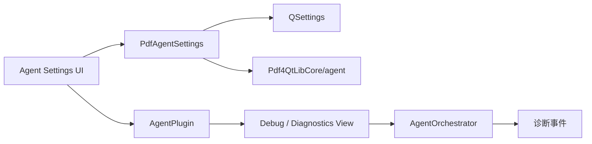
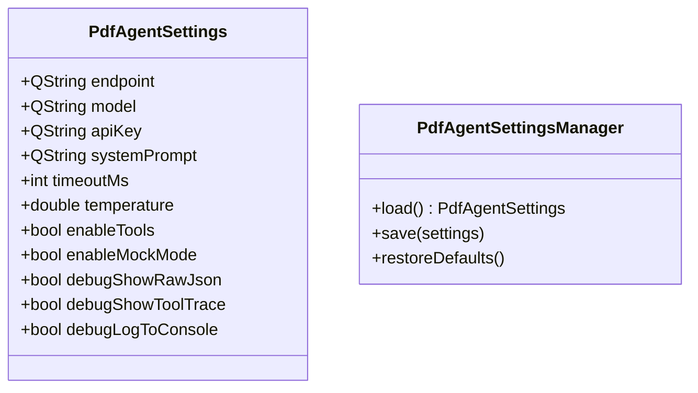
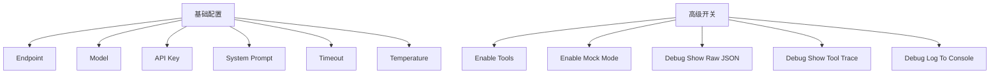
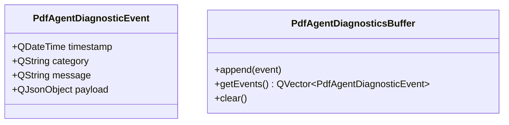
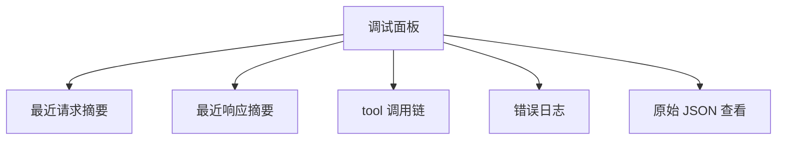
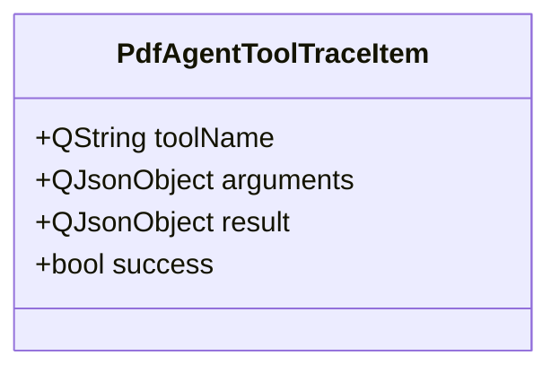
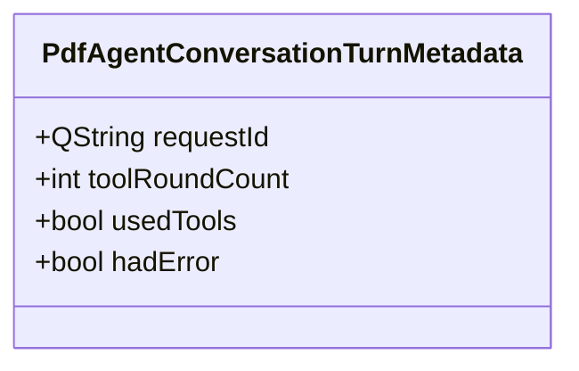
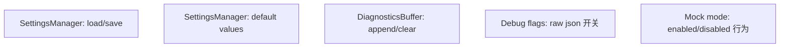

# PDF4QT AI Agent 第六阶段技术设计

## 文档目标

本文档定义 AI Agent 第六阶段的技术设计，目标是把前五个阶段的能力整理成一个可配置、可调试、可持续维护的系统。

第六阶段不是单一功能点，而是收口阶段。它要把前面已经存在的网络、UI、工具调用、修改类命令统一纳入稳定的工程化框架。

## 第六阶段范围

### 本阶段包含

- Agent 设置持久化
- 调试与诊断界面
- provider 配置整理
- mock 模式开关
- 会话级调试信息展示
- 日志输出规范

### 本阶段不包含

- 云端遥测平台
- 权限管理后台
- 多用户协作系统

## 第六阶段的核心目标

前五阶段完成后，系统已经“能用”。第六阶段要让系统“好维护、好排错、可持续演进”。

这意味着：

- 配置不能散落在各层
- 调试信息不能靠临时 `qDebug()`
- UI 需要适度暴露诊断能力
- provider 和模式切换需要明确入口

## 第六阶段总体结构



## 设置层设计

## 为什么要单独建设置结构

如果 endpoint、model、tool 开关、debug 模式分别散落在：

- UI 控件
- orchestrator
- plugin
- registry

后续会非常难维护。

因此第六阶段建议引入统一设置对象。

## 建议类设计



## 模块归属建议

### `PdfAgentSettings`

放在：

- `Pdf4QtLibCore/agent`

因为它是纯后端配置模型。

### 设置 UI

放在：

- `Pdf4QtEditorPlugins/AgentPlugin`
或
- `Pdf4QtLibGui`

因为它是纯界面层能力。

## QSettings 键设计

建议统一使用 `AIAgent/` 前缀。

### 推荐键

```text
AIAgent/Endpoint
AIAgent/Model
AIAgent/ApiKey
AIAgent/SystemPrompt
AIAgent/TimeoutMs
AIAgent/Temperature
AIAgent/EnableTools
AIAgent/EnableMockMode
AIAgent/DebugShowRawJson
AIAgent/DebugShowToolTrace
AIAgent/DebugLogToConsole
```

## 设置 UI 设计

## 建议入口

第六阶段建议增加：

- `AI Agent Settings...`

可放在：

- Agent 插件菜单
- 或主设置对话框的一个新页面

### 推荐方案

第一版优先做独立的 Agent 设置对话框，避免过早侵入现有大设置页。

## 设置对话框布局建议



## 配置应用策略

建议设置修改后：

- 点击 `Apply` 或 `OK` 即时更新 `AgentOrchestrator`
- 不要求重启应用

### 为什么不要求重启

因为：

- 模型 endpoint、timeout、debug 模式都属于运行时配置
- 用户在调试阶段会频繁调整

## 诊断系统设计

## 为什么必须有诊断系统

第四阶段和第五阶段之后，错误已经不只是“网络失败”这么简单，常见问题会包括：

- provider 响应结构不一致
- tools schema 不符合预期
- tool call 参数格式错误
- 用户拒绝导致的业务分支
- 命令执行结果与模型理解不一致

如果没有统一诊断系统，后续排错成本会非常高。

## 诊断事件模型



## 建议事件类别

- `network.request`
- `network.response`
- `network.error`
- `orchestrator.state`
- `tool.requested`
- `tool.result`
- `tool.error`
- `confirmation.requested`
- `confirmation.rejected`
- `confirmation.approved`

## 调试界面设计

## 目标

给开发和高级用户一个能观察 agent 行为的界面，而不是只看聊天流。

## 推荐方式

在聊天 Dock 内增加一个可折叠的 Debug 面板，或增加一个单独的 Diagnostics Dock。

### 推荐第一版

先在聊天 Dock 中增加“调试标签页”或“展开区域”。

原因：

- 开发成本低
- 不增加太多窗口管理负担

## 调试面板建议内容



## 原始 JSON 展示策略

只有当：

- `debugShowRawJson = true`

才展示：

- 最近一次 request JSON
- 最近一次 response JSON

### 注意事项

- 原始 JSON 展示时必须隐藏 API Key
- 不要把认证头完整显示在 UI 中

## Tool Trace 设计

第四、五阶段后，工具调用链已经较复杂，第六阶段应提供明确 trace。

## 建议 trace 结构



UI 中可以展示为：

```text
Tool: get_document_summary
Args: {}
Result: ok=true
```

## 会话层面的调试增强

第六阶段建议给每轮会话附加一个内部 request id，便于串联日志。

## 建议字段



## Mock 模式设置化

第三阶段的 mock 模式在第六阶段应正式进入设置系统，而不是只靠临时 UI 开关。

### 规则

- `enableMockMode = true` 时，插件可切换到 mock routing
- `enableMockMode = false` 时，正式环境默认不显示或不允许 mock 模式

这样可以避免调试模式误入生产使用流程。

## Provider 兼容策略

第六阶段可以开始整理 provider 差异，但不建议立刻做“大而全”的 provider 工厂。

## 更稳妥的方案

先在设置中明确：

- 当前只支持 OpenAI-compatible chat/tool API

未来若真要扩展，再增加：

- `providerType`

例如：

- `OpenAICompatible`
- `Custom`

但第六阶段不应让 provider 抽象压过当前主要目标。

## 日志策略

## 控制台日志

当：

- `debugLogToConsole = true`

时，允许输出调试日志：

- 关键状态变化
- tool call 名称
- 请求/响应摘要

## 日志要求

- 不输出明文 API Key
- 不输出过长敏感正文
- 对大 JSON 做截断或摘要

## 错误分层展示

第六阶段建议把错误分成三层：

### 用户层

显示在聊天流或状态栏中：

- 简短可理解的错误

### 调试层

显示在 diagnostics 面板：

- 更详细的错误上下文

### 开发层

输出到日志：

- 带 request id 和分类的调试信息

## UI 行为建议

## 状态栏消息

可以继续复用主窗口状态栏做短消息，例如：

- `AI Agent: request sent`
- `AI Agent: tool get_document_summary executed`
- `AI Agent: request failed`

但不要把详细调试信息挤到状态栏。

## 聊天区与调试区分工

### 聊天区

展示：

- 用户消息
- 助手回复
- 简要工具步骤

### 调试区

展示：

- 原始 JSON
- 完整 tool result
- 内部错误堆栈摘要

## 测试建议

## 单元测试重点



## 手工验证重点

- 修改设置后是否即时生效
- 应用重启后设置是否保留
- 调试面板是否能看到最近一次请求与工具链
- 关闭 debug 开关后是否不再暴露原始 JSON
- mock 模式关闭后是否无法误用

## 第六阶段完成标准

第六阶段完成时，应满足：

- Agent 配置有统一设置模型
- 设置可通过 `QSettings` 持久化
- 聊天 UI 有调试或诊断视图
- 能查看最近请求、响应和工具调用链
- mock 模式与 debug 开关可配置
- 日志输出有统一边界且不泄露敏感信息

## 第六阶段完成后的状态

完成第六阶段后，AI Agent 系统应达到一个“可持续开发”的状态：

- 后端核心在 `Pdf4QtLibCore`
- UI 适配在插件层或 GUI 层
- 功能有清晰的阶段边界
- 工具调用和写操作有安全控制
- 调试与配置手段完整

到这个阶段，后续的工作就不再是“从零搭系统”，而是围绕已有框架继续扩展命令、优化体验和提升稳定性。
